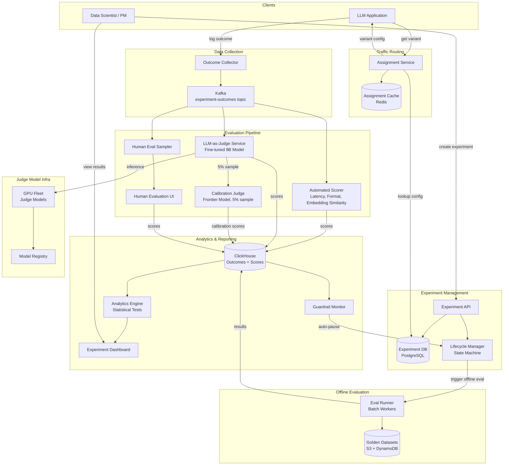
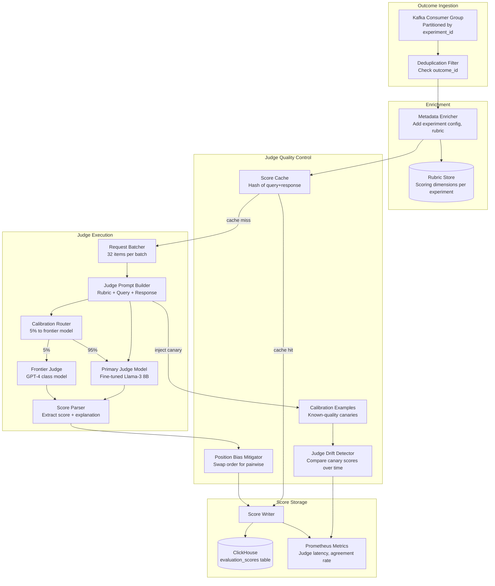
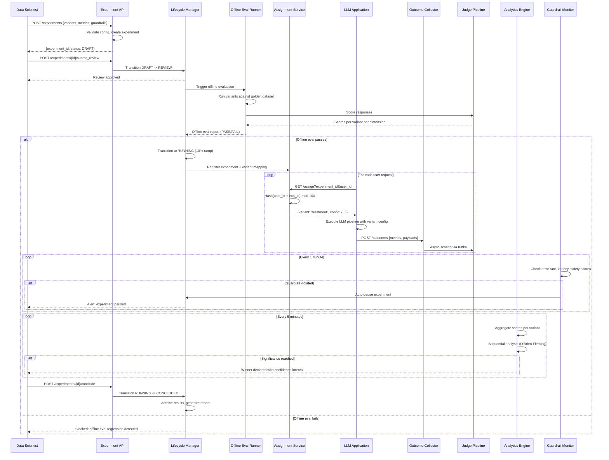

# Experimentation & Evaluation Platform for LLMs — Architecture Diagrams

## 1. High-Level Architecture

## 2. Deep-Dive: LLM-as-Judge Scoring Pipeline

## 3. Critical Path Sequence: Online Experiment Lifecycle

