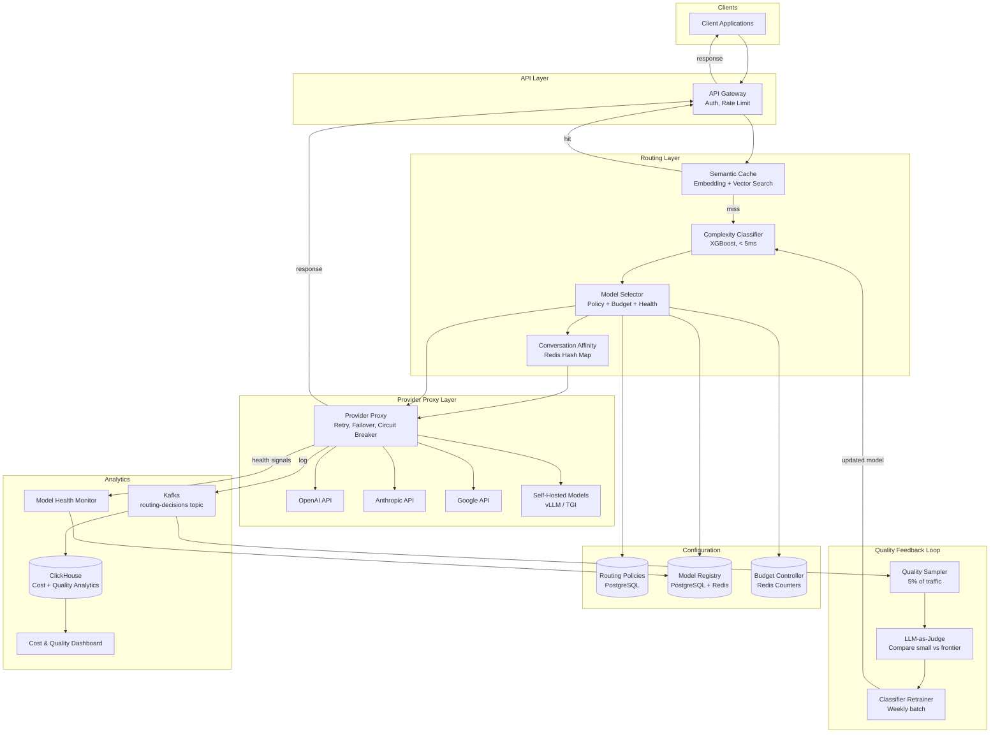
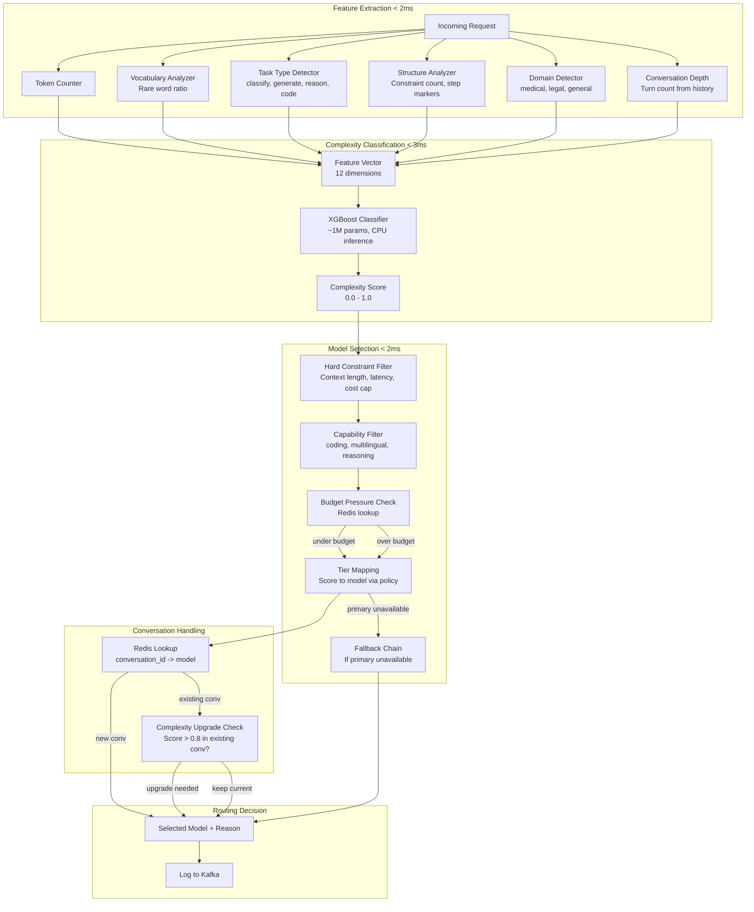
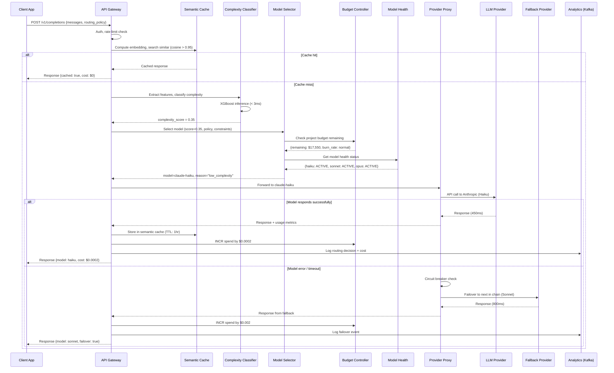

# Multi-Model Routing System — Architecture Diagrams

## 1. High-Level Architecture

## 2. Deep-Dive: Request Classification and Model Selection

## 3. Critical Path Sequence: Request Routing and Fallback

