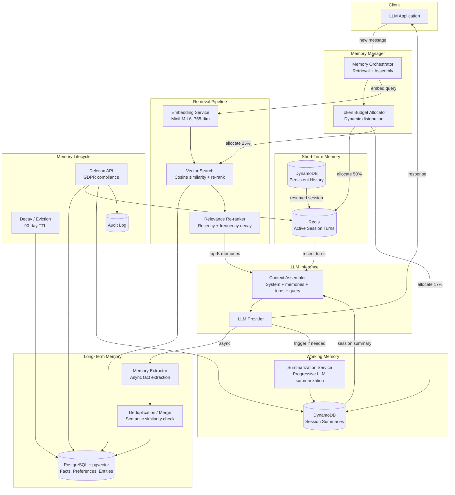
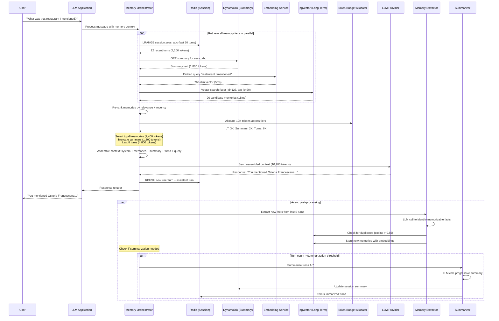

# Context Window Memory System — Architecture Diagrams

## 1. High-Level Architecture



## 2. Deep-Dive: Memory Retrieval and Context Assembly

```mermaid
flowchart TB
    subgraph Input[Query Input]
        QUERY[User Message<br/>"What was that restaurant?"]
    end

    subgraph Embedding[Embedding Generation - 5ms]
        EMBED_MODEL[MiniLM-L6-v2<br/>768-dim embedding]
        QUERY_VEC[Query Vector]
    end

    subgraph LT_Retrieval[Long-Term Retrieval - 15ms]
        VECTOR_IDX[(pgvector Index<br/>User-scoped partition)]
        CANDIDATES[Top-20 Candidates<br/>Cosine similarity]
        RECENCY[Recency Boost<br/>1.2x if accessed in last hour]
        FREQUENCY[Frequency Boost<br/>1.1x if accessed > 5 times]
        CATEGORY[Category Match<br/>Boost relevant categories]
        FINAL_LT[Top-10 Long-Term Memories<br/>Fit within 3K token budget]
    end

    subgraph Session_Retrieval[Session Data - 5ms each]
        SUMMARY_FETCH[Fetch Session Summary<br/>DynamoDB lookup]
        SUMMARY_TRUNC[Truncate to 2K tokens<br/>Keep most recent segments]
        TURNS_FETCH[Fetch Recent Turns<br/>Redis LRANGE]
        TURNS_FIT[Fit turns in 6K budget<br/>Last N turns, min 3]
    end

    subgraph Assembly[Context Assembly - 2ms]
        SYS_PROMPT[System Prompt<br/>1K tokens]
        LT_BLOCK["[Memory] blocks<br/>Formatted long-term memories"]
        SUMMARY_BLOCK["[Summary] block<br/>Session summary text"]
        TURNS_BLOCK[Recent Turns<br/>Full fidelity messages]
        FINAL_CTX[Assembled Context<br/>System + LT + Summary + Turns + Query]
    end

    subgraph Budget_Tracking[Token Budget Tracking]
        COUNTER[Running Token Counter<br/>Track per-section usage]
        OVERFLOW[Overflow Handler<br/>Redistribute unused tokens]
    end

    QUERY --> EMBED_MODEL
    EMBED_MODEL --> QUERY_VEC
    QUERY_VEC --> VECTOR_IDX
    VECTOR_IDX --> CANDIDATES
    CANDIDATES --> RECENCY
    RECENCY --> FREQUENCY
    FREQUENCY --> CATEGORY
    CATEGORY --> FINAL_LT

    QUERY --> SUMMARY_FETCH
    SUMMARY_FETCH --> SUMMARY_TRUNC

    QUERY --> TURNS_FETCH
    TURNS_FETCH --> TURNS_FIT

    SYS_PROMPT --> FINAL_CTX
    FINAL_LT --> LT_BLOCK
    LT_BLOCK --> FINAL_CTX
    SUMMARY_TRUNC --> SUMMARY_BLOCK
    SUMMARY_BLOCK --> FINAL_CTX
    TURNS_FIT --> TURNS_BLOCK
    TURNS_BLOCK --> FINAL_CTX

    FINAL_LT --> COUNTER
    SUMMARY_TRUNC --> COUNTER
    TURNS_FIT --> COUNTER
    COUNTER --> OVERFLOW
    OVERFLOW -->|redistribute| TURNS_FIT
```

## 3. Critical Path Sequence: Message Processing with Memory


