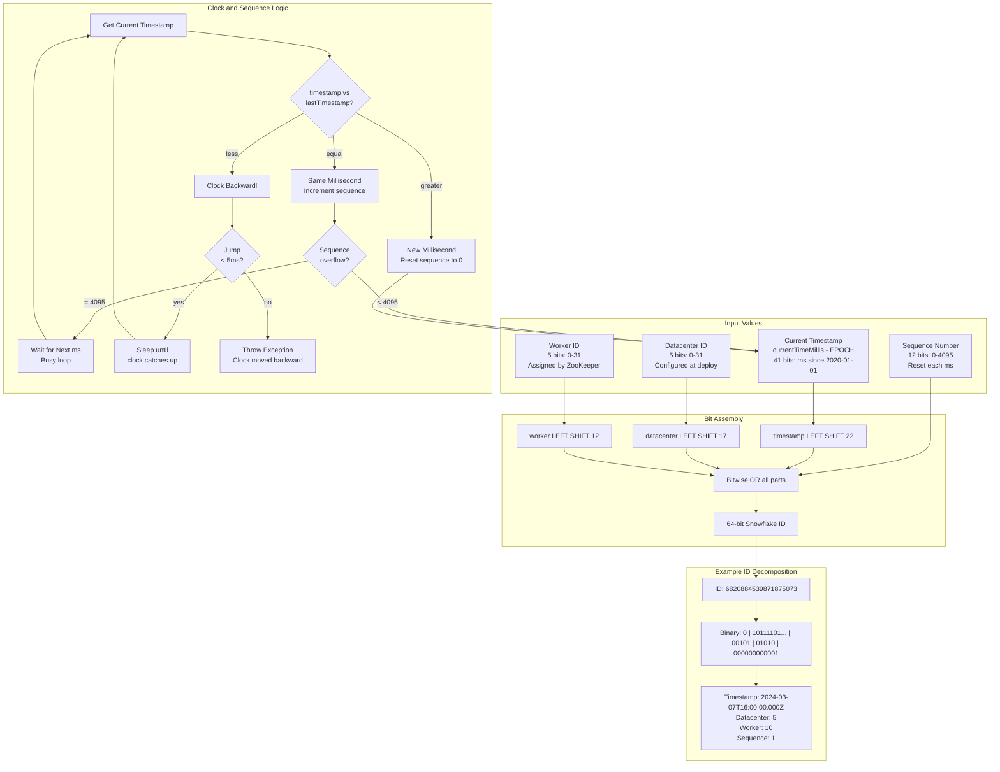
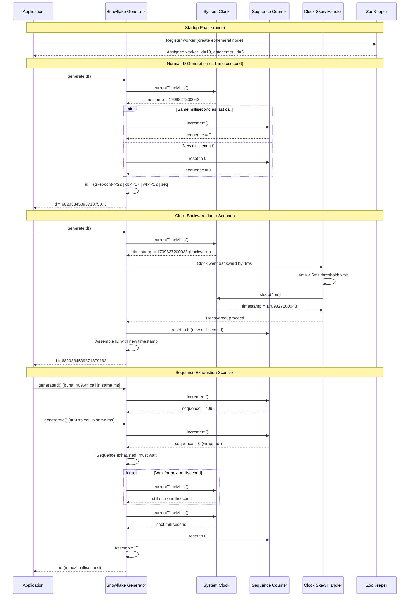

# Unique ID Generator (Snowflake) — Architecture Diagrams

## 1. High-Level Architecture

```mermaid
flowchart TB
    subgraph Applications[Application Services]
        SVC_A[Service A<br/>Embedded Generator]
        SVC_B[Service B<br/>Embedded Generator]
        SVC_C[Service C<br/>Embedded Generator]
    end

    subgraph Coordination[Worker ID Coordination]
        ZK[ZooKeeper Cluster<br/>3 or 5 nodes]
        ZK_NODE_A[/Ephemeral Node<br/>dc:5 worker:1/]
        ZK_NODE_B[/Ephemeral Node<br/>dc:5 worker:2/]
        ZK_NODE_C[/Ephemeral Node<br/>dc:5 worker:3/]
    end

    subgraph Generator[Snowflake Generator - In Process]
        CLOCK[System Clock<br/>currentTimeMillis]
        BIT_LAYOUT[Bit Layout Engine<br/>41 + 5 + 5 + 12 bits]
        SEQ[Sequence Counter<br/>0 - 4095 per ms]
        SKEW[Clock Skew Handler<br/>Wait / Logical Clock / Halt]
    end

    subgraph ID_Consumer[ID Consumers]
        DB[(Database<br/>Primary Keys)]
        EVENTS[Event Stream<br/>Kafka Message Keys]
        TRACE[Distributed Tracing<br/>Trace IDs]
    end

    subgraph Utilities
        PARSER[ID Parser Service<br/>Decompose ID to parts]
        MONITOR[Monitoring<br/>Generation rate, skew events]
    end

    SVC_A -->|startup: register| ZK
    SVC_B -->|startup: register| ZK
    SVC_C -->|startup: register| ZK
    ZK --> ZK_NODE_A
    ZK --> ZK_NODE_B
    ZK --> ZK_NODE_C
    ZK_NODE_A -->|worker_id=1| SVC_A
    ZK_NODE_B -->|worker_id=2| SVC_B
    ZK_NODE_C -->|worker_id=3| SVC_C

    CLOCK --> BIT_LAYOUT
    SEQ --> BIT_LAYOUT
    SKEW --> CLOCK

    SVC_A -->|generateId()| BIT_LAYOUT
    SVC_B -->|generateId()| BIT_LAYOUT
    SVC_C -->|generateId()| BIT_LAYOUT

    BIT_LAYOUT -->|64-bit ID| DB
    BIT_LAYOUT -->|64-bit ID| EVENTS
    BIT_LAYOUT -->|64-bit ID| TRACE

    BIT_LAYOUT --> PARSER
    BIT_LAYOUT --> MONITOR
```

## 2. Deep-Dive: Snowflake ID Bit Layout and Generation



## 3. Critical Path Sequence: ID Generation with Clock Skew Handling


