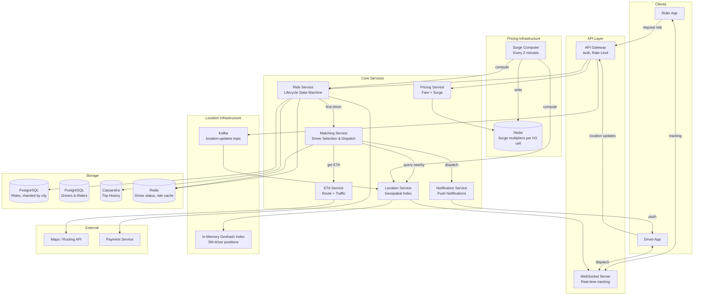
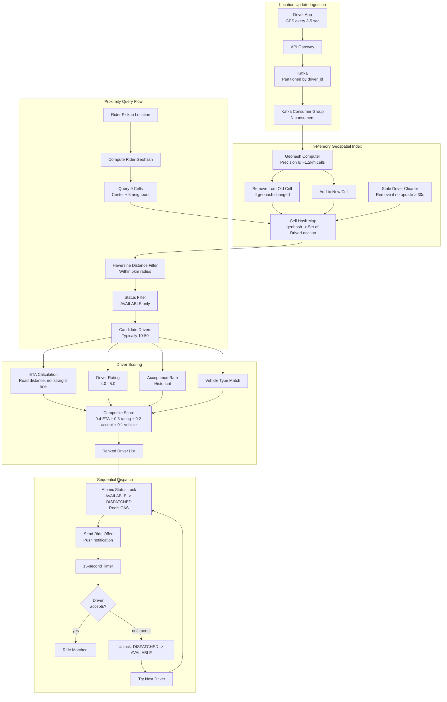
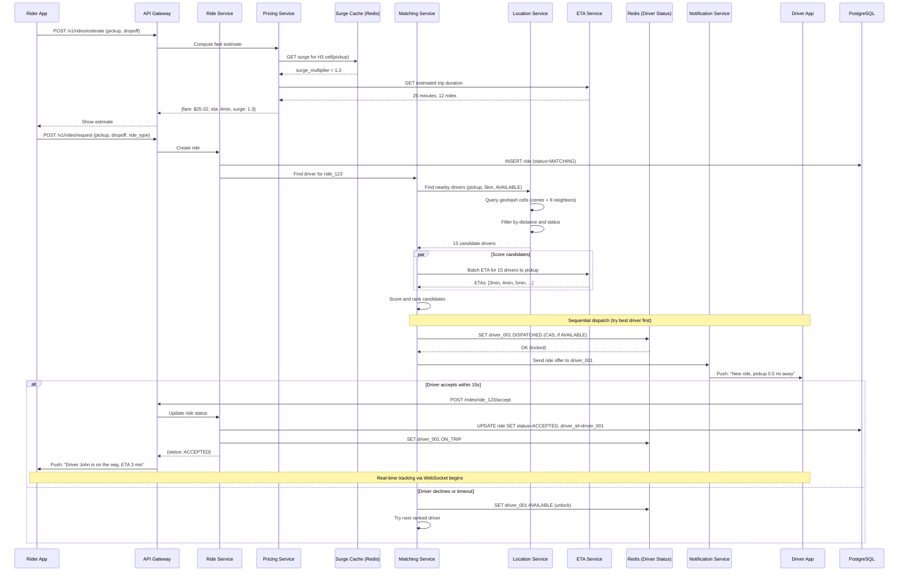

# Uber / Ride-Sharing — Architecture Diagrams

## 1. High-Level Architecture

## 2. Deep-Dive: Location Service and Geospatial Matching

## 3. Critical Path Sequence: Ride Request to Driver Matched

