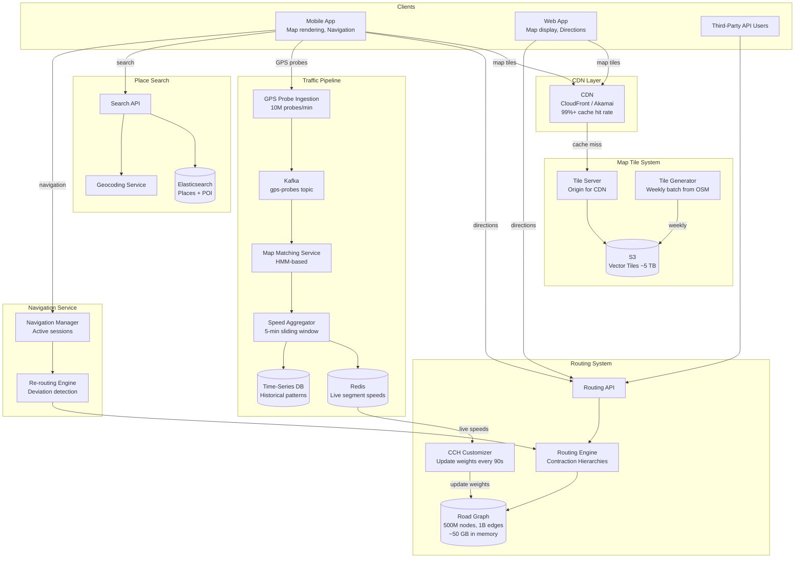
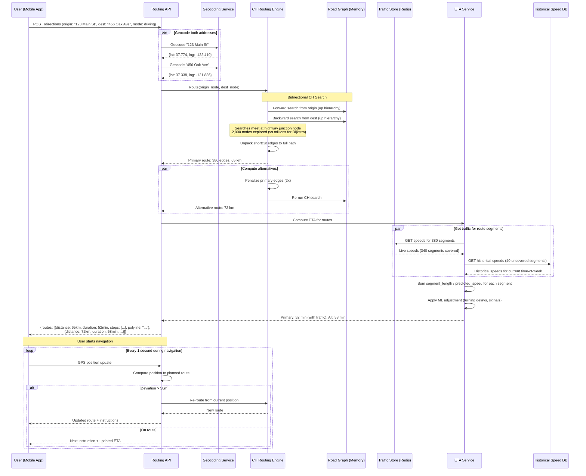

# Google Maps / Location Service — Architecture Diagrams

## 1. High-Level Architecture



## 2. Deep-Dive: Routing Engine with Contraction Hierarchies

```mermaid
flowchart TB
    subgraph Preprocessing[Offline Preprocessing - Hours]
        RAW_GRAPH[Raw Road Graph<br/>500M nodes, 1B edges]
        NODE_ORDER[Node Ordering<br/>Rank by importance<br/>Highway > Arterial > Local]
        CONTRACT[Node Contraction<br/>Remove low-importance nodes<br/>Add shortcut edges]
        CH_GRAPH[CH Graph<br/>Original + shortcut edges<br/>Hierarchical levels]
    end

    subgraph Live_Update[Live Weight Update - Every 90s]
        TRAFFIC_IN[Live Segment Speeds<br/>From Redis]
        HIST_IN[Historical Speeds<br/>For uncovered segments]
        BLEND[Speed Blending<br/>alpha * live + (1-alpha) * historical]
        BOTTOM_UP[Bottom-Up Weight Update<br/>Recompute shortcut weights<br/>1-2 seconds]
        UPDATED_CH[Updated CH Graph<br/>Ready for queries]
    end

    subgraph Query[Online Query - < 50ms]
        ORIGIN[Origin Node]
        DEST[Destination Node]
        FWD_SEARCH[Forward Dijkstra<br/>Only go UP hierarchy]
        BWD_SEARCH[Backward Dijkstra<br/>Only go UP hierarchy]
        MEETING[Meeting Point<br/>Top of hierarchy]
        UNPACK[Unpack Shortcuts<br/>Recover actual path]
        ROUTE[Full Route<br/>Turn-by-turn steps]
    end

    subgraph Alternatives[Alternative Routes]
        PRIMARY[Primary Route Found]
        PENALIZE[Penalize Primary Edges<br/>2x weight]
        REQUERY[Re-run CH Query]
        ALT_ROUTE[Alternative Route]
        DEDUP[Deduplicate<br/>Must differ by > 20%]
    end

    RAW_GRAPH --> NODE_ORDER
    NODE_ORDER --> CONTRACT
    CONTRACT --> CH_GRAPH

    TRAFFIC_IN --> BLEND
    HIST_IN --> BLEND
    BLEND --> BOTTOM_UP
    CH_GRAPH --> BOTTOM_UP
    BOTTOM_UP --> UPDATED_CH

    ORIGIN --> FWD_SEARCH
    DEST --> BWD_SEARCH
    UPDATED_CH --> FWD_SEARCH
    UPDATED_CH --> BWD_SEARCH
    FWD_SEARCH --> MEETING
    BWD_SEARCH --> MEETING
    MEETING --> UNPACK
    UNPACK --> ROUTE

    ROUTE --> PRIMARY
    PRIMARY --> PENALIZE
    PENALIZE --> REQUERY
    REQUERY --> ALT_ROUTE
    ALT_ROUTE --> DEDUP
```

## 3. Critical Path Sequence: Direction Request with Live Traffic


