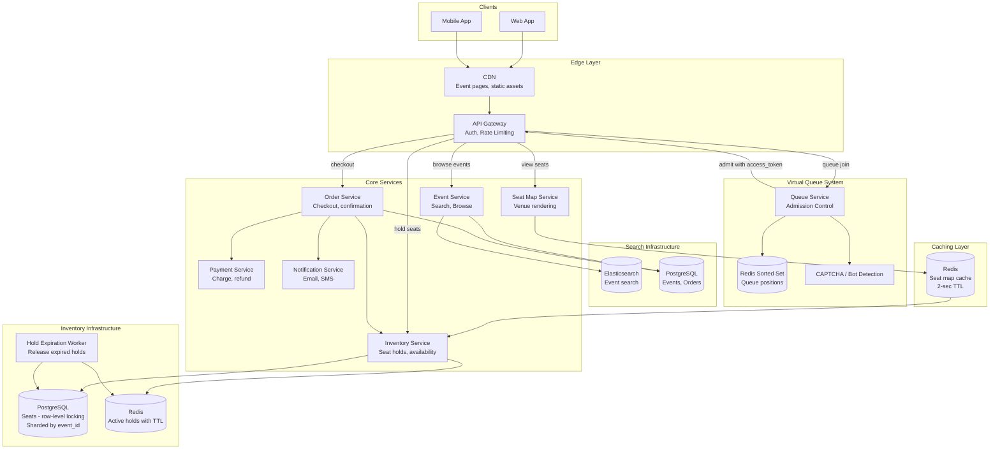

# Ticket Booking System (Ticketmaster) — Architecture Diagrams

## 1. High-Level Architecture



## 2. Deep-Dive: Inventory Management and Hold System

```mermaid
flowchart TB
    subgraph Hold_Request[Hold Acquisition Flow]
        USER_REQ[User Selects Seats<br/>A-101, A-102]
        VALIDATE_TOKEN[Validate Access Token<br/>JWT from queue]
        CHECK_LIMITS[Check User Limits<br/>Max 4 tickets per user]
    end

    subgraph DB_Transaction[PostgreSQL Transaction]
        BEGIN_TX[BEGIN TRANSACTION]
        SELECT_LOCK["SELECT ... FROM seats<br/>WHERE event_id=? AND seat_id IN (?)<br/>AND status='AVAILABLE'<br/>FOR UPDATE SKIP LOCKED"]
        CHECK_COUNT{All requested<br/>seats locked?}
        UPDATE_HOLD["UPDATE seats<br/>SET status='HELD',<br/>hold_id=?, hold_expires_at=NOW()+8min,<br/>version=version+1"]
        COMMIT[COMMIT]
        ROLLBACK[ROLLBACK<br/>Some seats unavailable]
    end

    subgraph Hold_Management[Hold State Management]
        REDIS_SET[Redis SET hold:{hold_id}<br/>TTL = 8 minutes]
        TIMER[Hold Timer<br/>5-min warning notification]
        EXPIRE_EVENT[Redis Key Expiration Event]
    end

    subgraph Expiration[Hold Expiration Flow]
        WORKER[Hold Expiration Worker]
        RELEASE["UPDATE seats<br/>SET status='AVAILABLE',<br/>hold_id=NULL<br/>WHERE hold_id=?"]
        NOTIFY_EXPIRE[Notify User<br/>Hold expired]
        REQUEUE[Seats Available<br/>Queue resumes admission]
    end

    subgraph Checkout[Checkout Flow]
        CHECKOUT_REQ[User Clicks Checkout]
        VERIFY_HOLD[Verify Hold Active<br/>Redis + DB check]
        CHARGE[Payment Service<br/>Charge with idempotency key]
        CONVERT["UPDATE seats SET status='SOLD'<br/>UPDATE holds SET status='CONVERTED'<br/>INSERT INTO orders"]
        CONFIRM[Order Confirmed<br/>Send tickets]
        PAY_FAIL[Payment Failed<br/>Hold remains active<br/>User can retry]
    end

    USER_REQ --> VALIDATE_TOKEN
    VALIDATE_TOKEN --> CHECK_LIMITS
    CHECK_LIMITS --> BEGIN_TX
    BEGIN_TX --> SELECT_LOCK
    SELECT_LOCK --> CHECK_COUNT
    CHECK_COUNT -->|yes| UPDATE_HOLD
    CHECK_COUNT -->|no| ROLLBACK
    UPDATE_HOLD --> COMMIT
    COMMIT --> REDIS_SET
    REDIS_SET --> TIMER

    EXPIRE_EVENT --> WORKER
    WORKER --> RELEASE
    RELEASE --> NOTIFY_EXPIRE
    RELEASE --> REQUEUE

    CHECKOUT_REQ --> VERIFY_HOLD
    VERIFY_HOLD --> CHARGE
    CHARGE -->|success| CONVERT
    CHARGE -->|failure| PAY_FAIL
    CONVERT --> CONFIRM
```

## 3. Critical Path Sequence: Hot Event On-Sale Flow

```mermaid
sequenceDiagram
    participant User as User (Browser)
    participant CDN as CDN
    participant GW as API Gateway
    participant Queue as Queue Service
    participant Redis_Q as Redis (Queue)
    participant SeatMap as Seat Map Service
    participant Inv as Inventory Service
    participant DB as PostgreSQL (Seats)
    participant Redis_H as Redis (Holds)
    participant Order as Order Service
    participant Pay as Payment Service
    participant Notif as Notification

    Note over User,Notif: Phase 1: Join Queue (30 min before on-sale)

    User->>GW: POST /queue/join {event_id}
    GW->>Queue: CAPTCHA verification
    Queue->>Queue: Verify CAPTCHA, device fingerprint
    Queue->>Redis_Q: ZADD queue:evt_123 {random_score} {user_id}
    Queue-->>User: {queue_token, position: 45230, est_wait: 12min}

    loop Poll every 5 seconds
        User->>Queue: GET /queue/status?token=qt_abc
        Queue->>Redis_Q: ZSCORE queue:evt_123 user_456
        Queue-->>User: {position: 45230, status: WAITING}
    end

    Note over User,Notif: Phase 2: On-Sale Time - Admission

    Queue->>Queue: On-sale time reached, begin admission at 500/sec
    Queue->>Redis_Q: ZPOPMIN queue:evt_123 (batch of users)
    Queue->>Queue: Generate access_token (JWT, 15-min TTL)
    Queue-->>User: {status: ADMITTED, access_token: at_xyz}

    Note over User,Notif: Phase 3: Seat Selection and Hold

    User->>GW: GET /events/evt_123/seats?section=A (with access_token)
    GW->>SeatMap: Get seat availability
    SeatMap->>Redis_H: Check cached seat map
    Redis_H-->>SeatMap: Seat map (2-sec cache)
    SeatMap-->>User: {seats: [{A-101: AVAILABLE}, {A-102: AVAILABLE}, ...]}

    User->>GW: POST /holds {seats: [A-101, A-102], access_token}
    GW->>Inv: Create hold

    Inv->>DB: BEGIN; SELECT ... FOR UPDATE SKIP LOCKED
    DB-->>Inv: Rows locked (both available)
    Inv->>DB: UPDATE seats SET status=HELD, hold_expires_at=+8min
    Inv->>DB: COMMIT
    Inv->>Redis_H: SET hold:hold_789 {seats} TTL=480s

    Inv-->>User: {hold_id: hold_789, expires_at: ..., total: $500}

    Note over User,Notif: Phase 4: Checkout

    User->>GW: POST /orders {hold_id: hold_789, payment_method}
    GW->>Order: Process checkout

    Order->>Redis_H: Verify hold active
    Redis_H-->>Order: Active (5 min remaining)

    Order->>Pay: Charge $500 (idempotency_key: hold_789)
    Pay-->>Order: Payment successful

    Order->>DB: BEGIN
    Order->>DB: UPDATE seats SET status=SOLD WHERE hold_id=hold_789
    Order->>DB: INSERT INTO orders (...)
    Order->>DB: COMMIT

    Order->>Redis_H: DEL hold:hold_789
    Order->>Notif: Send confirmation email + tickets

    Order-->>User: {order_id: ord_123, status: CONFIRMED, tickets: [...]}
```
