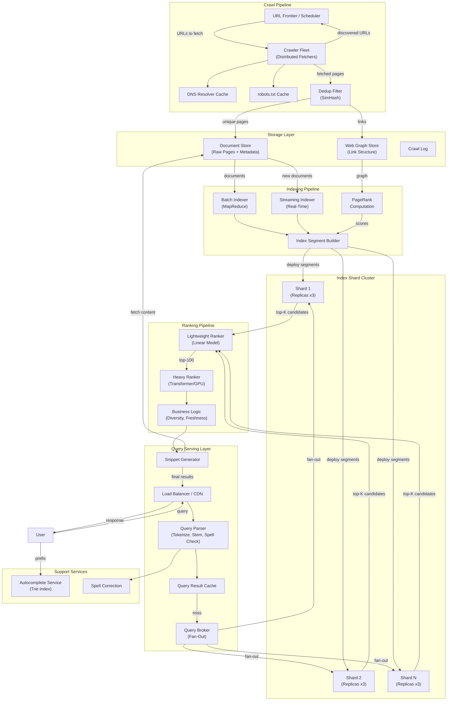
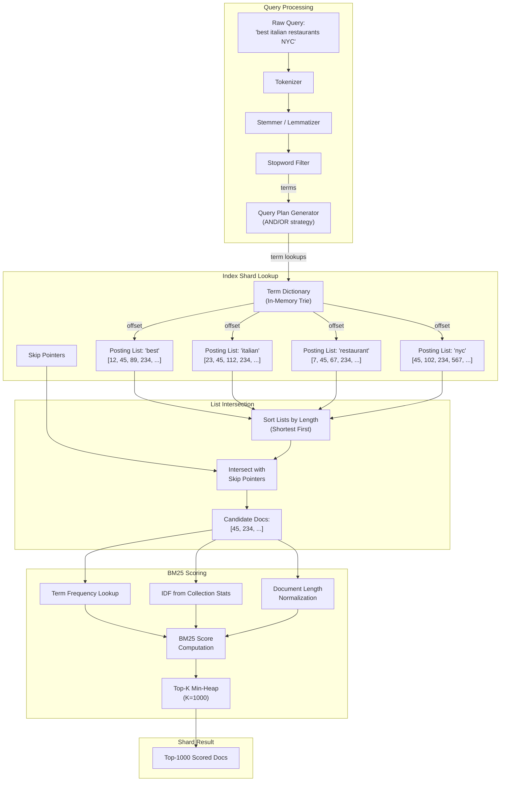
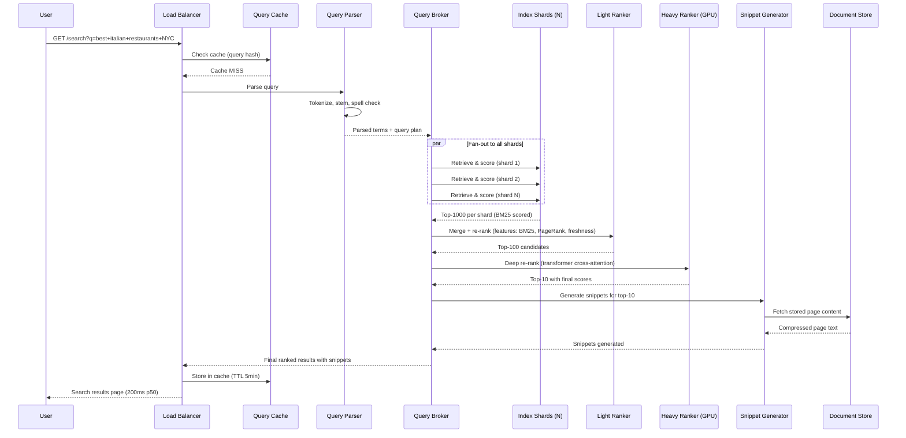

# Search Engine -- Architecture Diagrams

## 1. High-Level Architecture

```mermaid
flowchart TB
    subgraph Crawl_Pipeline["Crawl Pipeline"]
        URLFrontier["URL Frontier / Scheduler"]
        CrawlerFleet["Crawler Fleet<br/>(Distributed Fetchers)"]
        DNSResolver["DNS Resolver Cache"]
        RobotsCache["robots.txt Cache"]
        DedupFilter["Dedup Filter<br/>(SimHash)"]
    end

    subgraph Storage["Storage Layer"]
        DocStore["Document Store<br/>(Raw Pages + Metadata)"]
        WebGraph["Web Graph Store<br/>(Link Structure)"]
        CrawlLog["Crawl Log"]
    end

    subgraph Indexing["Indexing Pipeline"]
        BatchIndexer["Batch Indexer<br/>(MapReduce)"]
        StreamIndexer["Streaming Indexer<br/>(Real-Time)"]
        PageRankCompute["PageRank<br/>Computation"]
        IndexBuilder["Index Segment Builder"]
    end

    subgraph QueryServing["Query Serving Layer"]
        LB["Load Balancer / CDN"]
        QueryParser["Query Parser<br/>(Tokenize, Stem, Spell Check)"]
        QueryBroker["Query Broker<br/>(Fan-Out)"]
        Cache["Query Result Cache"]
        SnippetGen["Snippet Generator"]
    end

    subgraph IndexShards["Index Shard Cluster"]
        Shard1["Shard 1<br/>(Replicas x3)"]
        Shard2["Shard 2<br/>(Replicas x3)"]
        ShardN["Shard N<br/>(Replicas x3)"]
    end

    subgraph Ranking["Ranking Pipeline"]
        LightRanker["Lightweight Ranker<br/>(Linear Model)"]
        HeavyRanker["Heavy Ranker<br/>(Transformer/GPU)"]
        BusinessLogic["Business Logic<br/>(Diversity, Freshness)"]
    end

    subgraph Support["Support Services"]
        Autocomplete["Autocomplete Service<br/>(Trie Index)"]
        SpellCheck["Spell Correction"]
    end

    User["User"] -->|query| LB
    LB --> QueryParser
    QueryParser --> Cache
    Cache -->|miss| QueryBroker
    QueryBroker -->|fan-out| Shard1
    QueryBroker -->|fan-out| Shard2
    QueryBroker -->|fan-out| ShardN
    Shard1 -->|top-K candidates| LightRanker
    Shard2 -->|top-K candidates| LightRanker
    ShardN -->|top-K candidates| LightRanker
    LightRanker -->|top-100| HeavyRanker
    HeavyRanker --> BusinessLogic
    BusinessLogic --> SnippetGen
    SnippetGen -->|final results| LB
    LB -->|response| User

    User -->|prefix| Autocomplete
    QueryParser --> SpellCheck

    URLFrontier -->|URLs to fetch| CrawlerFleet
    CrawlerFleet --> DNSResolver
    CrawlerFleet --> RobotsCache
    CrawlerFleet -->|fetched pages| DedupFilter
    DedupFilter -->|unique pages| DocStore
    DedupFilter -->|links| WebGraph
    CrawlerFleet -->|discovered URLs| URLFrontier

    DocStore -->|documents| BatchIndexer
    DocStore -->|new documents| StreamIndexer
    WebGraph -->|graph| PageRankCompute
    BatchIndexer --> IndexBuilder
    StreamIndexer --> IndexBuilder
    PageRankCompute -->|scores| IndexBuilder
    IndexBuilder -->|deploy segments| Shard1
    IndexBuilder -->|deploy segments| Shard2
    IndexBuilder -->|deploy segments| ShardN

    SnippetGen -->|fetch content| DocStore
```

## 2. Deep-Dive: Inverted Index Query Execution

```mermaid
flowchart TB
    subgraph QueryProcessing["Query Processing"]
        RawQuery["Raw Query:<br/>'best italian restaurants NYC'"]
        Tokenizer["Tokenizer"]
        Stemmer["Stemmer / Lemmatizer"]
        StopwordFilter["Stopword Filter"]
        QueryPlan["Query Plan Generator<br/>(AND/OR strategy)"]
    end

    subgraph IndexLookup["Index Shard Lookup"]
        TermDict["Term Dictionary<br/>(In-Memory Trie)"]
        PL1["Posting List: 'best'<br/>[12, 45, 89, 234, ...]"]
        PL2["Posting List: 'italian'<br/>[23, 45, 112, 234, ...]"]
        PL3["Posting List: 'restaurant'<br/>[7, 45, 67, 234, ...]"]
        PL4["Posting List: 'nyc'<br/>[45, 102, 234, 567, ...]"]
        SkipPtrs["Skip Pointers"]
    end

    subgraph Intersection["List Intersection"]
        SortByLen["Sort Lists by Length<br/>(Shortest First)"]
        IntersectEngine["Intersect with<br/>Skip Pointers"]
        Candidates["Candidate Docs:<br/>[45, 234, ...]"]
    end

    subgraph Scoring["BM25 Scoring"]
        TFLookup["Term Frequency Lookup"]
        IDFCalc["IDF from Collection Stats"]
        LenNorm["Document Length<br/>Normalization"]
        BM25Score["BM25 Score<br/>Computation"]
        TopKHeap["Top-K Min-Heap<br/>(K=1000)"]
    end

    subgraph Result["Shard Result"]
        ShardTopK["Top-1000 Scored Docs"]
    end

    RawQuery --> Tokenizer
    Tokenizer --> Stemmer
    Stemmer --> StopwordFilter
    StopwordFilter -->|terms| QueryPlan
    QueryPlan -->|term lookups| TermDict

    TermDict -->|offset| PL1
    TermDict -->|offset| PL2
    TermDict -->|offset| PL3
    TermDict -->|offset| PL4

    PL1 --> SortByLen
    PL2 --> SortByLen
    PL3 --> SortByLen
    PL4 --> SortByLen
    SkipPtrs --> IntersectEngine
    SortByLen --> IntersectEngine
    IntersectEngine --> Candidates

    Candidates --> TFLookup
    Candidates --> IDFCalc
    Candidates --> LenNorm
    TFLookup --> BM25Score
    IDFCalc --> BM25Score
    LenNorm --> BM25Score
    BM25Score --> TopKHeap
    TopKHeap --> ShardTopK
```

## 3. Critical Path Sequence: Search Query Execution

```mermaid
sequenceDiagram
    participant User
    participant LB as Load Balancer
    participant Cache as Query Cache
    participant QP as Query Parser
    participant QB as Query Broker
    participant IS as Index Shards (N)
    participant LR as Light Ranker
    participant HR as Heavy Ranker (GPU)
    participant SG as Snippet Generator
    participant DS as Document Store

    User->>LB: GET /search?q=best+italian+restaurants+NYC
    LB->>Cache: Check cache (query hash)
    Cache-->>LB: Cache MISS

    LB->>QP: Parse query
    QP->>QP: Tokenize, stem, spell check
    QP-->>QB: Parsed terms + query plan

    par Fan-out to all shards
        QB->>IS: Retrieve & score (shard 1)
        QB->>IS: Retrieve & score (shard 2)
        QB->>IS: Retrieve & score (shard N)
    end

    IS-->>QB: Top-1000 per shard (BM25 scored)

    QB->>LR: Merge + re-rank (features: BM25, PageRank, freshness)
    LR-->>QB: Top-100 candidates

    QB->>HR: Deep re-rank (transformer cross-attention)
    HR-->>QB: Top-10 with final scores

    QB->>SG: Generate snippets for top-10
    SG->>DS: Fetch stored page content
    DS-->>SG: Compressed page text
    SG-->>QB: Snippets generated

    QB-->>LB: Final ranked results with snippets
    LB->>Cache: Store in cache (TTL 5min)
    LB-->>User: Search results page (200ms p50)
```
