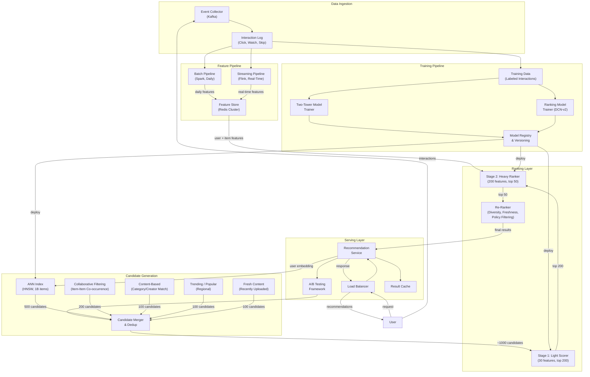
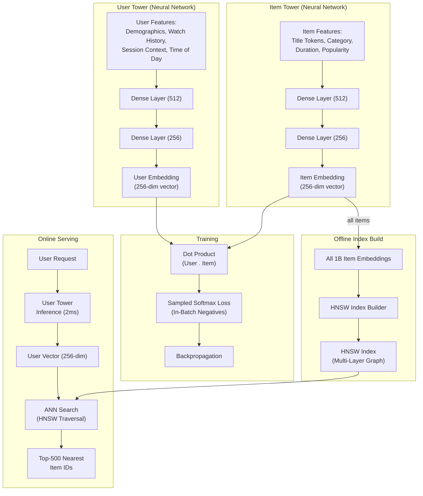
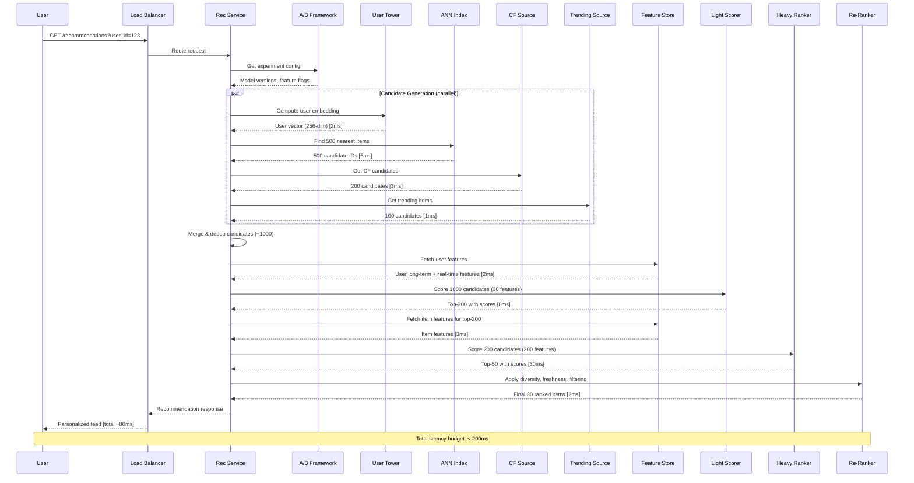

# Recommendation System -- Architecture Diagrams

## 1. High-Level Architecture

```mermaid
flowchart TB
    subgraph DataIngestion["Data Ingestion"]
        EventCollector["Event Collector<br/>(Kafka)"]
        InteractionLog["Interaction Log<br/>(Click, Watch, Skip)"]
    end

    subgraph FeaturePipeline["Feature Pipeline"]
        BatchPipeline["Batch Pipeline<br/>(Spark, Daily)"]
        StreamPipeline["Streaming Pipeline<br/>(Flink, Real-Time)"]
        FeatureStore["Feature Store<br/>(Redis Cluster)"]
    end

    subgraph TrainingPipeline["Training Pipeline"]
        TrainingData["Training Data<br/>(Labeled Interactions)"]
        TwoTowerTrainer["Two-Tower Model<br/>Trainer"]
        RankerTrainer["Ranking Model<br/>Trainer (DCN-v2)"]
        ModelRegistry["Model Registry<br/>& Versioning"]
    end

    subgraph CandidateGeneration["Candidate Generation"]
        ANNIndex["ANN Index<br/>(HNSW, 1B items)"]
        CFSource["Collaborative Filtering<br/>(Item-Item Co-occurrence)"]
        ContentSource["Content-Based<br/>(Category/Creator Match)"]
        TrendingSource["Trending / Popular<br/>(Regional)"]
        FreshSource["Fresh Content<br/>(Recently Uploaded)"]
        CandidateMerger["Candidate Merger<br/>& Dedup"]
    end

    subgraph RankingLayer["Ranking Layer"]
        LightScorer["Stage 1: Light Scorer<br/>(30 features, top 200)"]
        HeavyRanker["Stage 2: Heavy Ranker<br/>(200 features, top 50)"]
        ReRanker["Re-Ranker<br/>(Diversity, Freshness,<br/>Policy Filtering)"]
    end

    subgraph Serving["Serving Layer"]
        LB["Load Balancer"]
        RecService["Recommendation<br/>Service"]
        ABFramework["A/B Testing<br/>Framework"]
        ResultCache["Result Cache"]
    end

    User["User"] -->|request| LB
    LB --> RecService
    RecService --> ABFramework
    ABFramework --> CandidateMerger

    RecService -->|user embedding| ANNIndex
    ANNIndex -->|500 candidates| CandidateMerger
    CFSource -->|200 candidates| CandidateMerger
    ContentSource -->|100 candidates| CandidateMerger
    TrendingSource -->|100 candidates| CandidateMerger
    FreshSource -->|100 candidates| CandidateMerger

    CandidateMerger -->|~1000 candidates| LightScorer
    LightScorer -->|top 200| HeavyRanker
    FeatureStore -->|user + item features| HeavyRanker
    HeavyRanker -->|top 50| ReRanker
    ReRanker -->|final results| RecService
    RecService --> ResultCache
    RecService -->|response| LB
    LB -->|recommendations| User

    User -->|interactions| EventCollector
    EventCollector --> InteractionLog
    InteractionLog --> BatchPipeline
    InteractionLog --> StreamPipeline
    BatchPipeline -->|daily features| FeatureStore
    StreamPipeline -->|real-time features| FeatureStore

    InteractionLog --> TrainingData
    TrainingData --> TwoTowerTrainer
    TrainingData --> RankerTrainer
    TwoTowerTrainer --> ModelRegistry
    RankerTrainer --> ModelRegistry
    ModelRegistry -->|deploy| ANNIndex
    ModelRegistry -->|deploy| LightScorer
    ModelRegistry -->|deploy| HeavyRanker
```

## 2. Deep-Dive: Two-Tower Model and ANN Retrieval

```mermaid
flowchart TB
    subgraph UserTower["User Tower (Neural Network)"]
        UserInput["User Features:<br/>Demographics, Watch History,<br/>Session Context, Time of Day"]
        UserEmbLayer1["Dense Layer (512)"]
        UserEmbLayer2["Dense Layer (256)"]
        UserEmb["User Embedding<br/>(256-dim vector)"]
    end

    subgraph ItemTower["Item Tower (Neural Network)"]
        ItemInput["Item Features:<br/>Title Tokens, Category,<br/>Duration, Popularity"]
        ItemEmbLayer1["Dense Layer (512)"]
        ItemEmbLayer2["Dense Layer (256)"]
        ItemEmb["Item Embedding<br/>(256-dim vector)"]
    end

    subgraph Training["Training"]
        DotProduct["Dot Product<br/>(User . Item)"]
        SampledSoftmax["Sampled Softmax Loss<br/>(In-Batch Negatives)"]
        BackProp["Backpropagation"]
    end

    subgraph Offline["Offline Index Build"]
        AllItems["All 1B Item Embeddings"]
        HNSWBuild["HNSW Index Builder"]
        HNSWIndex["HNSW Index<br/>(Multi-Layer Graph)"]
    end

    subgraph OnlineServing["Online Serving"]
        UserQuery["User Request"]
        UserTowerInference["User Tower<br/>Inference (2ms)"]
        UserVec["User Vector (256-dim)"]
        ANNSearch["ANN Search<br/>(HNSW Traversal)"]
        TopKItems["Top-500 Nearest<br/>Item IDs"]
    end

    UserInput --> UserEmbLayer1 --> UserEmbLayer2 --> UserEmb
    ItemInput --> ItemEmbLayer1 --> ItemEmbLayer2 --> ItemEmb

    UserEmb --> DotProduct
    ItemEmb --> DotProduct
    DotProduct --> SampledSoftmax --> BackProp

    ItemEmb -->|all items| AllItems
    AllItems --> HNSWBuild --> HNSWIndex

    UserQuery --> UserTowerInference --> UserVec
    UserVec --> ANNSearch
    HNSWIndex --> ANNSearch
    ANNSearch --> TopKItems
```

## 3. Critical Path Sequence: Recommendation Request

```mermaid
sequenceDiagram
    participant User
    participant LB as Load Balancer
    participant RS as Rec Service
    participant AB as A/B Framework
    participant UT as User Tower
    participant ANN as ANN Index
    participant CF as CF Source
    participant TR as Trending Source
    participant FS as Feature Store
    participant L1 as Light Scorer
    participant L2 as Heavy Ranker
    participant RR as Re-Ranker

    User->>LB: GET /recommendations?user_id=123
    LB->>RS: Route request
    RS->>AB: Get experiment config
    AB-->>RS: Model versions, feature flags

    par Candidate Generation (parallel)
        RS->>UT: Compute user embedding
        UT-->>RS: User vector (256-dim) [2ms]
        RS->>ANN: Find 500 nearest items
        ANN-->>RS: 500 candidate IDs [5ms]
        RS->>CF: Get CF candidates
        CF-->>RS: 200 candidates [3ms]
        RS->>TR: Get trending items
        TR-->>RS: 100 candidates [1ms]
    end

    RS->>RS: Merge & dedup candidates (~1000)

    RS->>FS: Fetch user features
    FS-->>RS: User long-term + real-time features [2ms]

    RS->>L1: Score 1000 candidates (30 features)
    L1-->>RS: Top-200 with scores [8ms]

    RS->>FS: Fetch item features for top-200
    FS-->>RS: Item features [3ms]

    RS->>L2: Score 200 candidates (200 features)
    L2-->>RS: Top-50 with scores [30ms]

    RS->>RR: Apply diversity, freshness, filtering
    RR-->>RS: Final 30 ranked items [2ms]

    RS-->>LB: Recommendation response
    LB-->>User: Personalized feed [total ~80ms]

    Note over User,RR: Total latency budget: < 200ms
```
