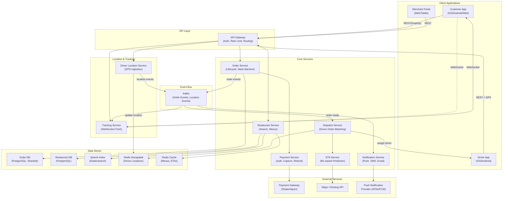
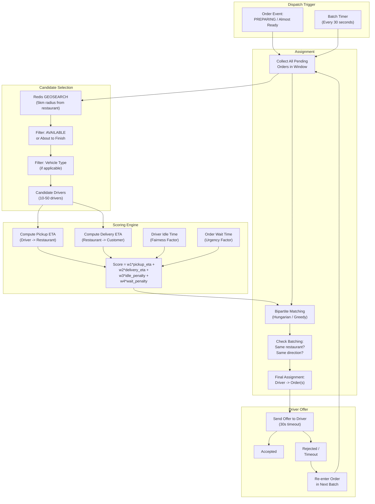
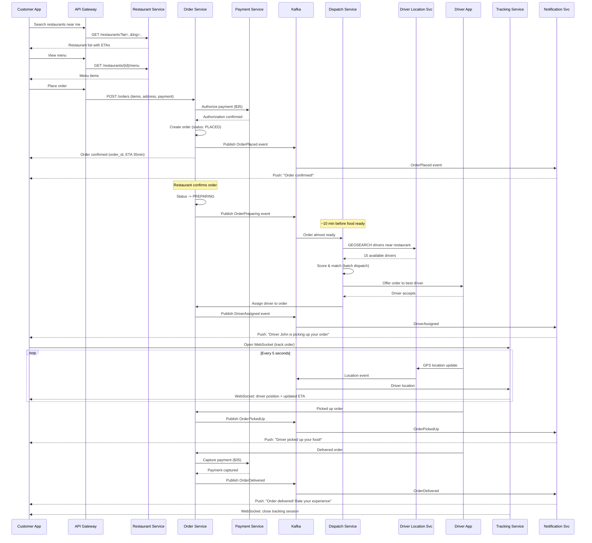

# Food Delivery System -- Architecture Diagrams

## 1. High-Level Architecture

```mermaid
flowchart TB
    subgraph Clients["Client Applications"]
        CustomerApp["Customer App<br/>(iOS/Android/Web)"]
        DriverApp["Driver App<br/>(iOS/Android)"]
        MerchantPortal["Merchant Portal<br/>(Web/Tablet)"]
    end

    subgraph Gateway["API Layer"]
        APIGateway["API Gateway<br/>(Auth, Rate Limit, Routing)"]
    end

    subgraph CoreServices["Core Services"]
        RestaurantSvc["Restaurant Service<br/>(Search, Menus)"]
        OrderSvc["Order Service<br/>(Lifecycle, State Machine)"]
        PaymentSvc["Payment Service<br/>(Auth, Capture, Refund)"]
        DispatchSvc["Dispatch Service<br/>(Driver-Order Matching)"]
        ETASvc["ETA Service<br/>(ML-based Prediction)"]
        NotifSvc["Notification Service<br/>(Push, SMS, Email)"]
    end

    subgraph LocationServices["Location & Tracking"]
        DriverLocSvc["Driver Location Service<br/>(GPS Ingestion)"]
        TrackingSvc["Tracking Service<br/>(WebSocket Push)"]
    end

    subgraph DataStores["Data Stores"]
        OrderDB["Order DB<br/>(PostgreSQL, Sharded)"]
        RestaurantDB["Restaurant DB<br/>(PostgreSQL)"]
        SearchIndex["Search Index<br/>(Elasticsearch)"]
        RedisGeo["Redis Geospatial<br/>(Driver Locations)"]
        RedisCache["Redis Cache<br/>(Menus, ETAs)"]
    end

    subgraph Messaging["Event Bus"]
        Kafka["Kafka<br/>(Order Events, Location Events)"]
    end

    subgraph External["External Services"]
        PaymentGW["Payment Gateway<br/>(Stripe/Adyen)"]
        MapsAPI["Maps / Routing API"]
        PushProvider["Push Notification<br/>Provider (APNs/FCM)"]
    end

    CustomerApp -->|REST/GraphQL| APIGateway
    DriverApp -->|REST + GPS| APIGateway
    MerchantPortal -->|REST| APIGateway

    APIGateway --> RestaurantSvc
    APIGateway --> OrderSvc
    APIGateway --> DriverLocSvc
    APIGateway --> TrackingSvc

    RestaurantSvc --> RestaurantDB
    RestaurantSvc --> SearchIndex
    RestaurantSvc --> RedisCache

    OrderSvc --> OrderDB
    OrderSvc -->|order events| Kafka
    OrderSvc --> PaymentSvc
    PaymentSvc --> PaymentGW

    Kafka -->|order ready| DispatchSvc
    DispatchSvc --> RedisGeo
    DispatchSvc --> ETASvc
    ETASvc --> MapsAPI
    DispatchSvc -->|assign driver| DriverApp

    DriverLocSvc -->|update location| RedisGeo
    DriverLocSvc -->|location events| Kafka
    Kafka --> TrackingSvc
    TrackingSvc -->|WebSocket| CustomerApp

    Kafka --> NotifSvc
    NotifSvc --> PushProvider

    CustomerApp -.->|WebSocket| TrackingSvc
```

## 2. Deep-Dive: Dispatch Engine

```mermaid
flowchart TB
    subgraph Trigger["Dispatch Trigger"]
        OrderReady["Order Event:<br/>PREPARING / Almost Ready"]
        BatchTimer["Batch Timer<br/>(Every 30 seconds)"]
    end

    subgraph CandidateSelection["Candidate Selection"]
        GeoQuery["Redis GEOSEARCH<br/>(5km radius from restaurant)"]
        FilterStatus["Filter: AVAILABLE<br/>or About to Finish"]
        FilterVehicle["Filter: Vehicle Type<br/>(if applicable)"]
        CandidateList["Candidate Drivers<br/>(10-50 drivers)"]
    end

    subgraph Scoring["Scoring Engine"]
        PickupETA["Compute Pickup ETA<br/>(Driver -> Restaurant)"]
        DeliveryETA["Compute Delivery ETA<br/>(Restaurant -> Customer)"]
        DriverIdle["Driver Idle Time<br/>(Fairness Factor)"]
        OrderWait["Order Wait Time<br/>(Urgency Factor)"]
        ScoreCalc["Score = w1*pickup_eta +<br/>w2*delivery_eta +<br/>w3*idle_penalty +<br/>w4*wait_penalty"]
    end

    subgraph Matching["Assignment"]
        BatchCollect["Collect All Pending<br/>Orders in Window"]
        BipartiteMatch["Bipartite Matching<br/>(Hungarian / Greedy)"]
        StackCheck["Check Batching:<br/>Same restaurant?<br/>Same direction?"]
        Assignment["Final Assignment:<br/>Driver -> Order(s)"]
    end

    subgraph DriverOffer["Driver Offer"]
        SendOffer["Send Offer to Driver<br/>(30s timeout)"]
        Accepted["Accepted"]
        Rejected["Rejected /<br/>Timeout"]
        Reassign["Re-enter Order<br/>in Next Batch"]
    end

    OrderReady --> BatchCollect
    BatchTimer --> BatchCollect

    BatchCollect --> GeoQuery
    GeoQuery --> FilterStatus --> FilterVehicle --> CandidateList

    CandidateList --> PickupETA
    CandidateList --> DeliveryETA
    PickupETA --> ScoreCalc
    DeliveryETA --> ScoreCalc
    DriverIdle --> ScoreCalc
    OrderWait --> ScoreCalc

    ScoreCalc --> BipartiteMatch
    BatchCollect --> BipartiteMatch
    BipartiteMatch --> StackCheck
    StackCheck --> Assignment

    Assignment --> SendOffer
    SendOffer --> Accepted
    SendOffer --> Rejected
    Rejected --> Reassign
    Reassign --> BatchCollect
```

## 3. Critical Path Sequence: Order Lifecycle

```mermaid
sequenceDiagram
    participant C as Customer App
    participant GW as API Gateway
    participant RS as Restaurant Service
    participant OS as Order Service
    participant PS as Payment Service
    participant K as Kafka
    participant DS as Dispatch Service
    participant DL as Driver Location Svc
    participant D as Driver App
    participant TS as Tracking Service
    participant NS as Notification Svc

    C->>GW: Search restaurants near me
    GW->>RS: GET /restaurants?lat=..&lng=..
    RS-->>C: Restaurant list with ETAs

    C->>GW: View menu
    GW->>RS: GET /restaurants/{id}/menu
    RS-->>C: Menu items

    C->>GW: Place order
    GW->>OS: POST /orders (items, address, payment)
    OS->>PS: Authorize payment ($35)
    PS-->>OS: Authorization confirmed
    OS->>OS: Create order (status: PLACED)
    OS->>K: Publish OrderPlaced event
    OS-->>C: Order confirmed (order_id, ETA 35min)

    K->>NS: OrderPlaced event
    NS-->>C: Push: "Order confirmed!"

    Note over OS: Restaurant confirms order
    OS->>OS: Status -> PREPARING
    OS->>K: Publish OrderPreparing event

    Note over DS: ~10 min before food ready
    K->>DS: Order almost ready
    DS->>DL: GEOSEARCH drivers near restaurant
    DL-->>DS: 15 available drivers
    DS->>DS: Score & match (batch dispatch)
    DS->>D: Offer order to best driver
    D-->>DS: Driver accepts

    DS->>OS: Assign driver to order
    OS->>K: Publish DriverAssigned event
    K->>NS: DriverAssigned
    NS-->>C: Push: "Driver John is picking up your order"

    C->>TS: Open WebSocket (track order)

    loop Every 5 seconds
        D->>DL: GPS location update
        DL->>K: Location event
        K->>TS: Driver location
        TS-->>C: WebSocket: driver position + updated ETA
    end

    D->>OS: Picked up order
    OS->>K: Publish OrderPickedUp
    K->>NS: OrderPickedUp
    NS-->>C: Push: "Driver picked up your food!"

    D->>OS: Delivered order
    OS->>PS: Capture payment ($35)
    PS-->>OS: Payment captured
    OS->>K: Publish OrderDelivered
    K->>NS: OrderDelivered
    NS-->>C: Push: "Order delivered! Rate your experience"
    TS-->>C: WebSocket: close tracking session
```
