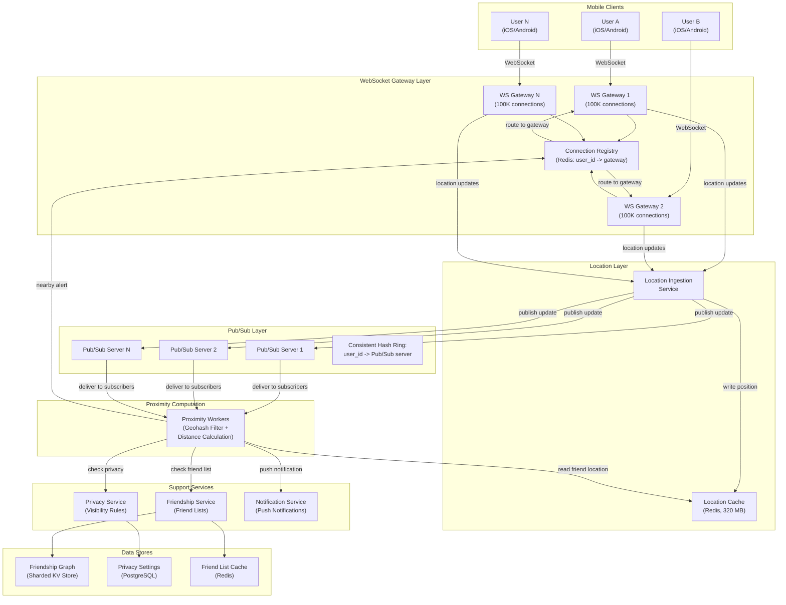
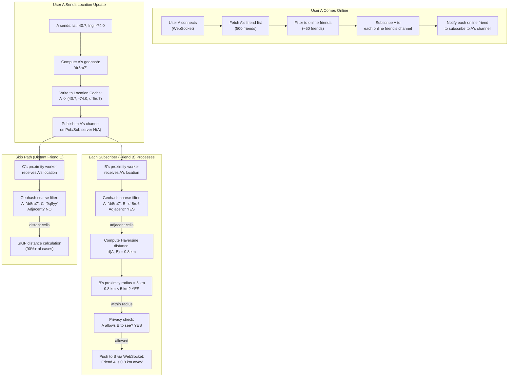
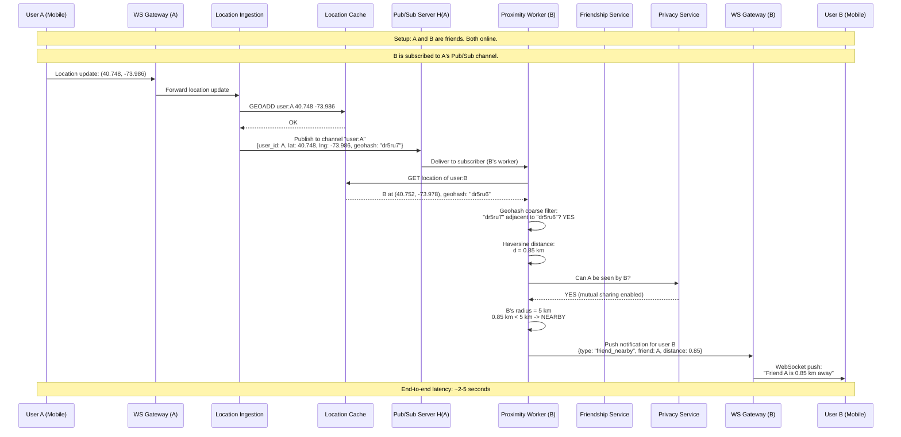

# Proximity Service (Nearby Friends) -- Architecture Diagrams

## 1. High-Level Architecture

## 2. Deep-Dive: Pub/Sub Channel and Proximity Computation

## 3. Critical Path Sequence: Friend Proximity Detection

