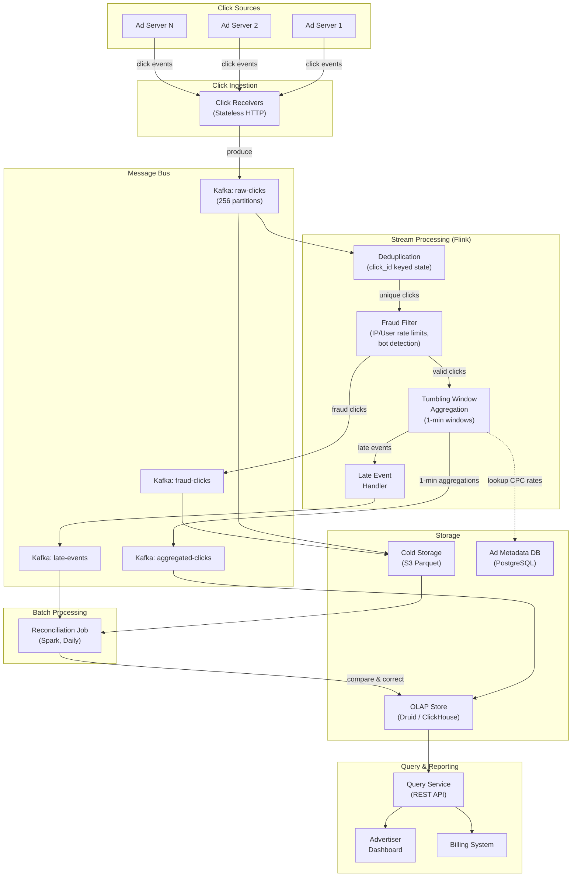
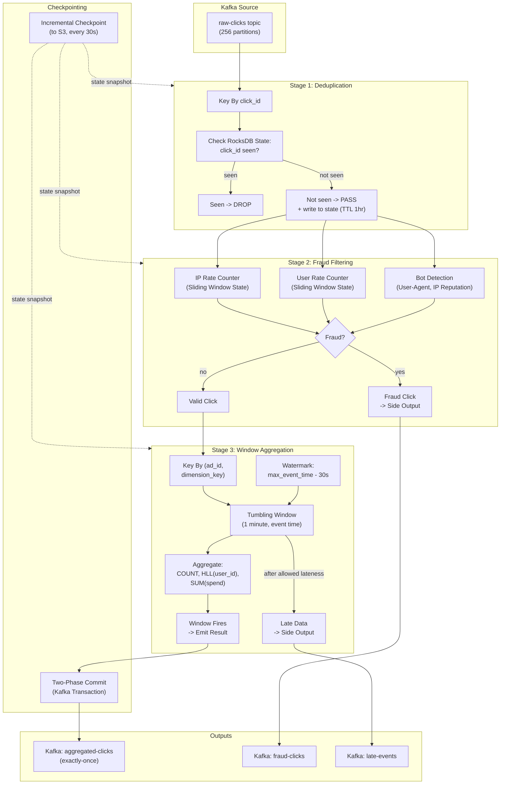
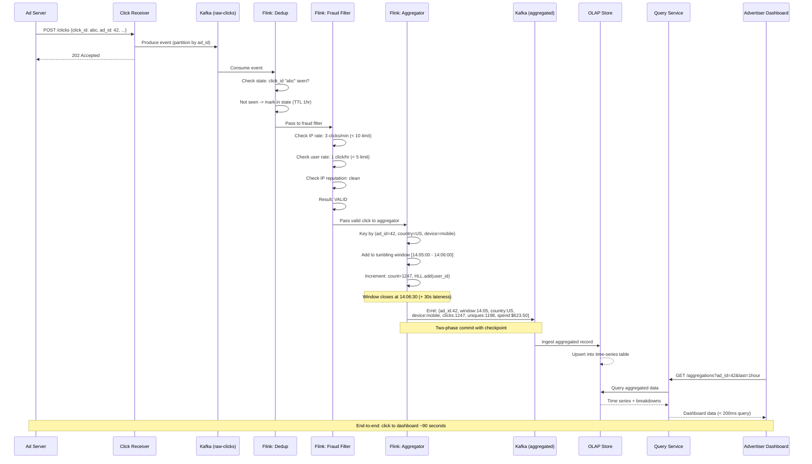

# Ad Click Aggregation System -- Architecture Diagrams

## 1. High-Level Architecture

## 2. Deep-Dive: Flink Streaming Aggregation Pipeline

## 3. Critical Path Sequence: Click Event Through the Pipeline

