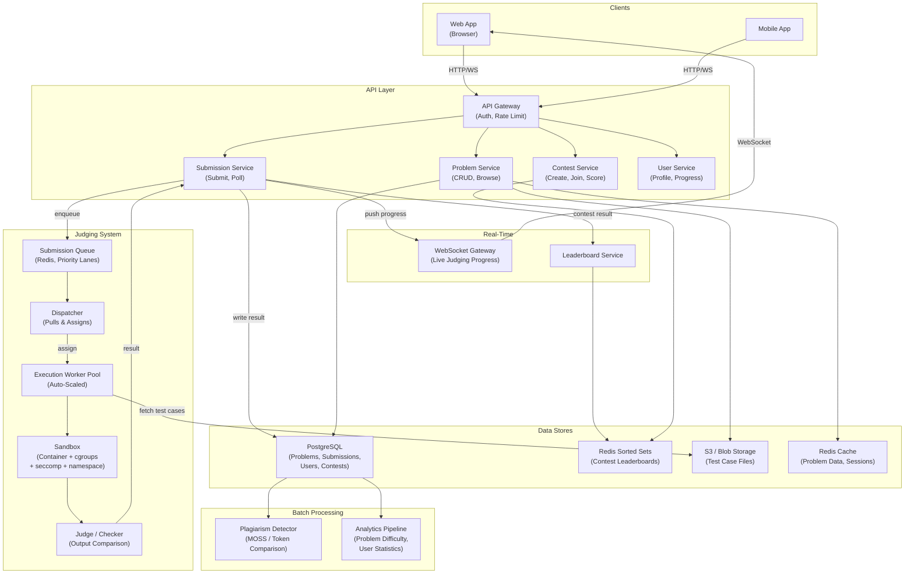
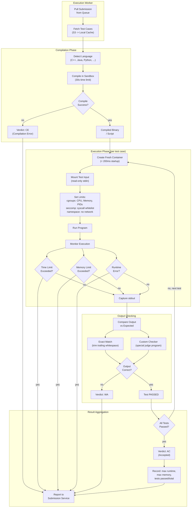
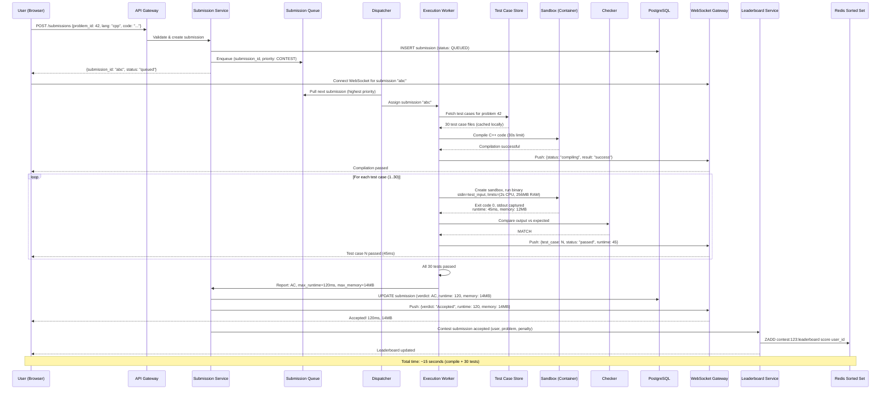

# Online Judge (LeetCode) -- Architecture Diagrams

## 1. High-Level Architecture

```mermaid
flowchart TB
    subgraph Clients["Clients"]
        WebApp["Web App<br/>(Browser)"]
        MobileApp["Mobile App"]
    end

    subgraph APILayer["API Layer"]
        APIGateway["API Gateway<br/>(Auth, Rate Limit)"]
        ProblemSvc["Problem Service<br/>(CRUD, Browse)"]
        SubmissionSvc["Submission Service<br/>(Submit, Poll)"]
        ContestSvc["Contest Service<br/>(Create, Join, Score)"]
        UserSvc["User Service<br/>(Profile, Progress)"]
    end

    subgraph Judging["Judging System"]
        SubmissionQueue["Submission Queue<br/>(Redis, Priority Lanes)"]
        Dispatcher["Dispatcher<br/>(Pulls & Assigns)"]
        WorkerPool["Execution Worker Pool<br/>(Auto-Scaled)"]
        Sandbox["Sandbox<br/>(Container + cgroups<br/>+ seccomp + namespace)"]
        Checker["Judge / Checker<br/>(Output Comparison)"]
    end

    subgraph RealTime["Real-Time"]
        WSGateway["WebSocket Gateway<br/>(Live Judging Progress)"]
        LeaderboardSvc["Leaderboard Service"]
    end

    subgraph DataStores["Data Stores"]
        PostgresDB["PostgreSQL<br/>(Problems, Submissions,<br/>Users, Contests)"]
        RedisLeaderboard["Redis Sorted Sets<br/>(Contest Leaderboards)"]
        TestCaseStore["S3 / Blob Storage<br/>(Test Case Files)"]
        RedisCache["Redis Cache<br/>(Problem Data, Sessions)"]
    end

    subgraph Batch["Batch Processing"]
        PlagiarismDetector["Plagiarism Detector<br/>(MOSS / Token Comparison)"]
        Analytics["Analytics Pipeline<br/>(Problem Difficulty,<br/>User Statistics)"]
    end

    WebApp -->|HTTP/WS| APIGateway
    MobileApp -->|HTTP/WS| APIGateway

    APIGateway --> ProblemSvc
    APIGateway --> SubmissionSvc
    APIGateway --> ContestSvc
    APIGateway --> UserSvc

    SubmissionSvc -->|enqueue| SubmissionQueue
    SubmissionQueue --> Dispatcher
    Dispatcher -->|assign| WorkerPool
    WorkerPool --> Sandbox
    Sandbox --> Checker
    WorkerPool -->|fetch test cases| TestCaseStore

    Checker -->|result| SubmissionSvc
    SubmissionSvc -->|write result| PostgresDB
    SubmissionSvc -->|push progress| WSGateway
    WSGateway -->|WebSocket| WebApp

    SubmissionSvc -->|contest result| LeaderboardSvc
    LeaderboardSvc --> RedisLeaderboard
    ContestSvc --> RedisLeaderboard

    ProblemSvc --> PostgresDB
    ProblemSvc --> RedisCache
    ProblemSvc --> TestCaseStore

    PostgresDB --> PlagiarismDetector
    PostgresDB --> Analytics
```

## 2. Deep-Dive: Sandboxed Execution Worker

```mermaid
flowchart TB
    subgraph Worker["Execution Worker"]
        PullJob["Pull Submission<br/>from Queue"]
        FetchTestCases["Fetch Test Cases<br/>(S3 -> Local Cache)"]
    end

    subgraph Compilation["Compilation Phase"]
        LangDetect["Detect Language<br/>(C++, Java, Python, ...)"]
        CompileSandbox["Compile in Sandbox<br/>(30s time limit)"]
        CompileResult{"Compile<br/>Success?"}
        CEVerdict["Verdict: CE<br/>(Compilation Error)"]
        Binary["Compiled Binary<br/>/ Script"]
    end

    subgraph Execution["Execution Phase (per test case)"]
        CreateContainer["Create Fresh Container<br/>(< 200ms startup)"]
        MountInput["Mount Test Input<br/>(read-only stdin)"]
        SetLimits["Set Limits:<br/>cgroups: CPU, Memory, PIDs<br/>seccomp: syscall whitelist<br/>namespace: no network"]
        RunProgram["Run Program"]
        Monitor["Monitor Execution"]
        TimeCheck{"Time Limit<br/>Exceeded?"}
        MemCheck{"Memory Limit<br/>Exceeded?"}
        RuntimeCheck{"Runtime<br/>Error?"}
        CaptureOutput["Capture stdout"]
    end

    subgraph Checking["Output Checking"]
        CompareOutput["Compare Output<br/>vs Expected"]
        ExactMatch["Exact Match<br/>(trim trailing whitespace)"]
        CustomChecker["Custom Checker<br/>(special judge program)"]
        CheckResult{"Output<br/>Correct?"}
        WAVerdict["Verdict: WA"]
        PassTest["Test PASSED"]
    end

    subgraph Results["Result Aggregation"]
        AllPassed{"All Tests<br/>Passed?"}
        ACVerdict["Verdict: AC<br/>(Accepted)"]
        RecordMetrics["Record: max runtime,<br/>max memory,<br/>tests passed/total"]
        ReportResult["Report to<br/>Submission Service"]
    end

    PullJob --> FetchTestCases --> LangDetect
    LangDetect --> CompileSandbox
    CompileSandbox --> CompileResult
    CompileResult -->|no| CEVerdict --> ReportResult
    CompileResult -->|yes| Binary

    Binary --> CreateContainer
    CreateContainer --> MountInput --> SetLimits --> RunProgram --> Monitor

    Monitor --> TimeCheck
    TimeCheck -->|yes| ReportResult
    Monitor --> MemCheck
    MemCheck -->|yes| ReportResult
    Monitor --> RuntimeCheck
    RuntimeCheck -->|yes| ReportResult

    TimeCheck -->|no| CaptureOutput
    MemCheck -->|no| CaptureOutput
    RuntimeCheck -->|no| CaptureOutput

    CaptureOutput --> CompareOutput
    CompareOutput --> ExactMatch
    CompareOutput --> CustomChecker
    ExactMatch --> CheckResult
    CustomChecker --> CheckResult
    CheckResult -->|no| WAVerdict --> ReportResult
    CheckResult -->|yes| PassTest

    PassTest --> AllPassed
    AllPassed -->|no, next test| CreateContainer
    AllPassed -->|yes| ACVerdict --> RecordMetrics --> ReportResult
```

## 3. Critical Path Sequence: Code Submission and Judging

```mermaid
sequenceDiagram
    participant U as User (Browser)
    participant API as API Gateway
    participant SS as Submission Service
    participant Q as Submission Queue
    participant D as Dispatcher
    participant W as Execution Worker
    participant S3 as Test Case Store
    participant SB as Sandbox (Container)
    participant CK as Checker
    participant DB as PostgreSQL
    participant WS as WebSocket Gateway
    participant LS as Leaderboard Service
    participant R as Redis Sorted Set

    U->>API: POST /submissions {problem_id: 42, lang: "cpp", code: "..."}
    API->>SS: Validate & create submission
    SS->>DB: INSERT submission (status: QUEUED)
    SS->>Q: Enqueue (submission_id, priority: CONTEST)
    SS-->>U: {submission_id: "abc", status: "queued"}

    U->>WS: Connect WebSocket for submission "abc"

    D->>Q: Pull next submission (highest priority)
    D->>W: Assign submission "abc"

    W->>S3: Fetch test cases for problem 42
    S3-->>W: 30 test case files (cached locally)

    W->>SB: Compile C++ code (30s limit)
    SB-->>W: Compilation successful

    W->>WS: Push: {status: "compiling", result: "success"}
    WS-->>U: Compilation passed

    loop For each test case (1..30)
        W->>SB: Create sandbox, run binary<br/>stdin=test_input, limits=(2s CPU, 256MB RAM)
        SB-->>W: Exit code 0, stdout captured<br/>runtime: 45ms, memory: 12MB

        W->>CK: Compare output vs expected
        CK-->>W: MATCH

        W->>WS: Push: {test_case: N, status: "passed", runtime: 45}
        WS-->>U: Test case N passed (45ms)
    end

    W->>W: All 30 tests passed
    W->>SS: Report: AC, max_runtime=120ms, max_memory=14MB

    SS->>DB: UPDATE submission (verdict: AC, runtime: 120, memory: 14MB)

    SS->>WS: Push: {verdict: "Accepted", runtime: 120, memory: 14MB}
    WS-->>U: Accepted! 120ms, 14MB

    SS->>LS: Contest submission accepted (user, problem, penalty)
    LS->>R: ZADD contest:123:leaderboard score user_id
    LS-->>U: Leaderboard updated

    Note over U,R: Total time: ~15 seconds (compile + 30 tests)
```
