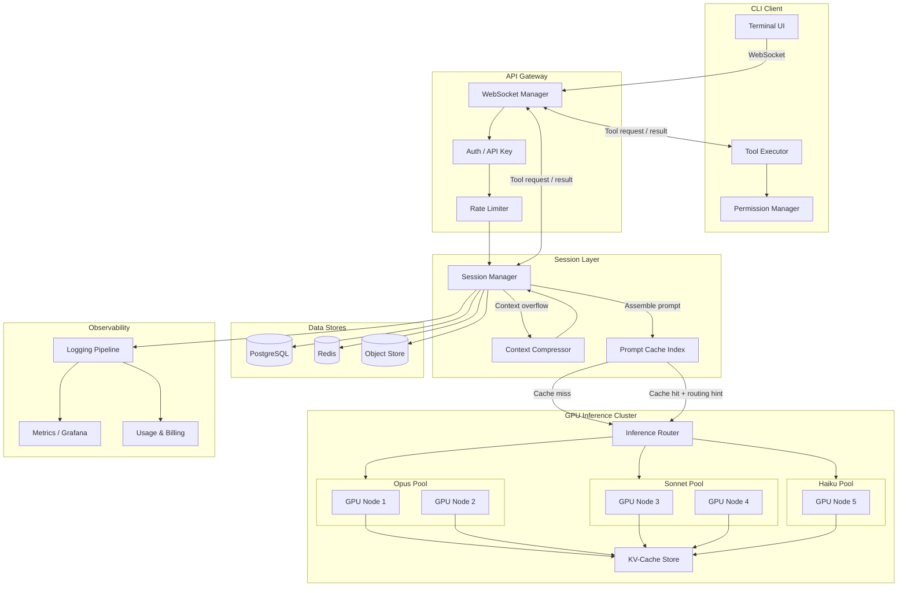
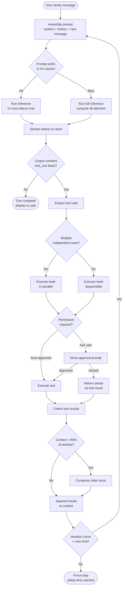
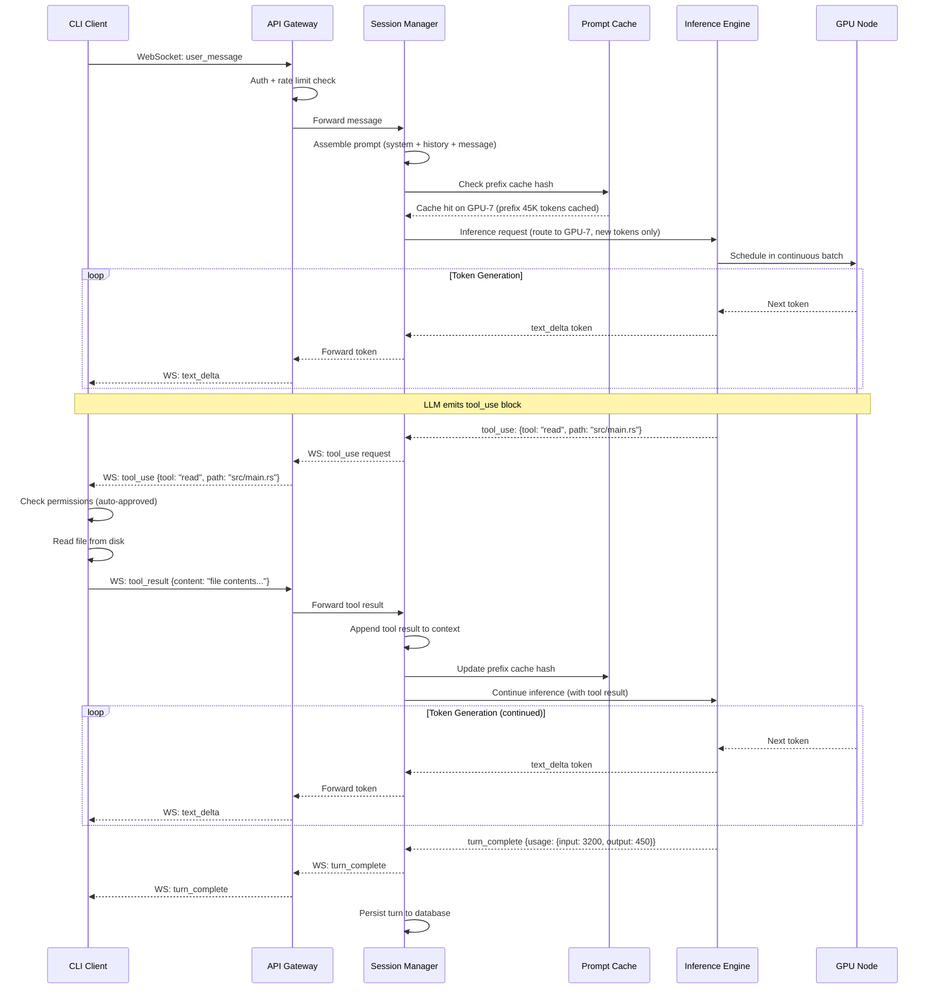

# Real-Time AI Coding Assistant (Claude Code) -- Architecture Diagrams

## 1. High-Level Architecture

## 2. Agentic Tool Execution Loop -- Deep Dive

## 3. Streaming Token Delivery -- Sequence Diagram

