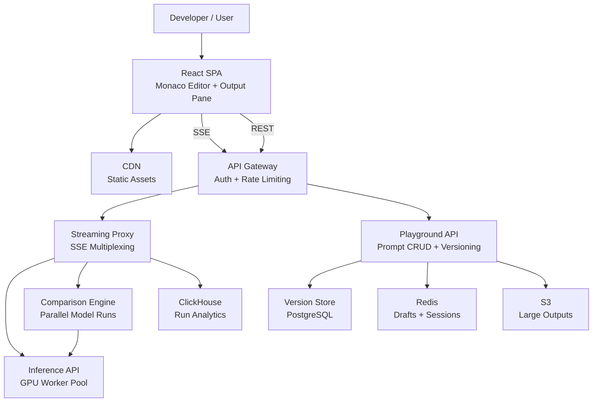
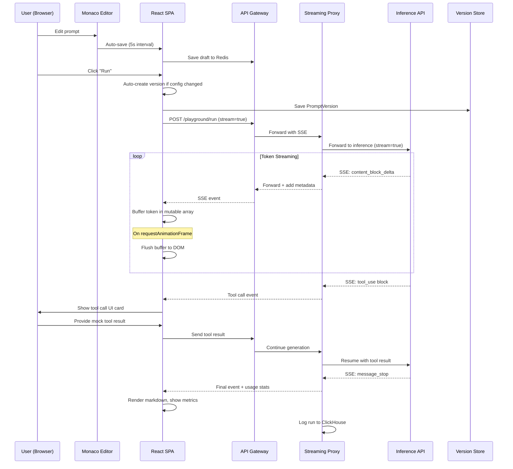
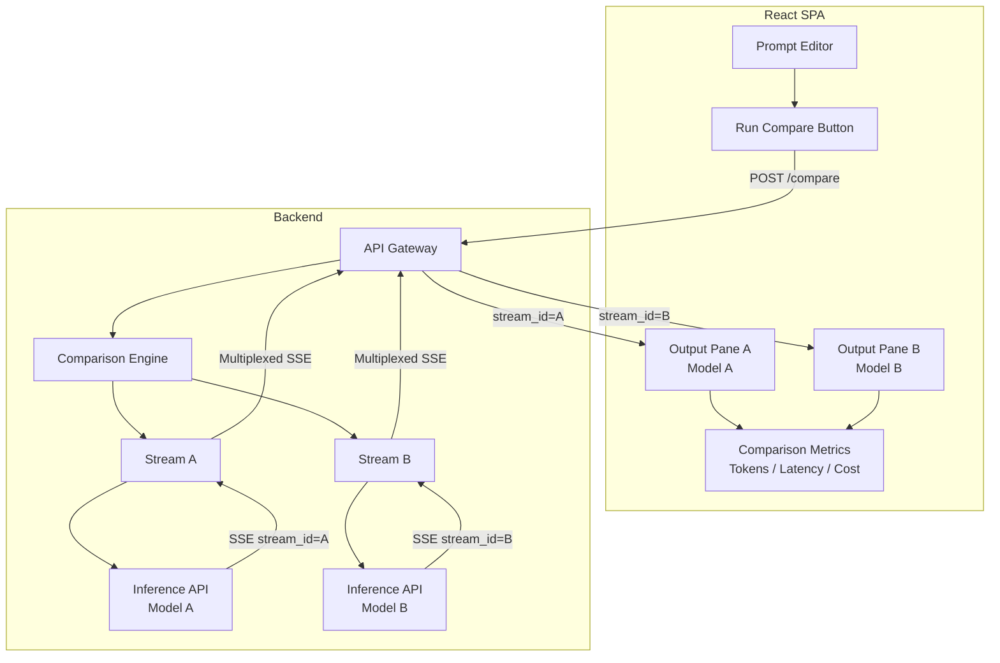
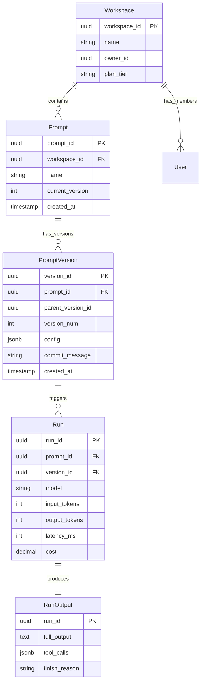

# Prompt Engineering Playground -- Architecture Diagrams

## 1. High-Level Architecture

```mermaid
flowchart TD
    User[Developer / User]
    SPA[React SPA<br/>Monaco Editor + Output Pane]
    CDN[CDN<br/>Static Assets]
    GW[API Gateway<br/>Auth + Rate Limiting]
    SP[Streaming Proxy<br/>SSE Multiplexing]
    PA[Playground API<br/>Prompt CRUD + Versioning]
    CE[Comparison Engine<br/>Parallel Model Runs]
    INF[Inference API<br/>GPU Worker Pool]
    VS[Version Store<br/>PostgreSQL]
    REDIS[Redis<br/>Drafts + Sessions]
    S3[S3<br/>Large Outputs]
    CH[ClickHouse<br/>Run Analytics]

    User --> SPA
    SPA --> CDN
    SPA -->|SSE| GW
    SPA -->|REST| GW
    GW --> SP
    GW --> PA
    SP --> INF
    SP --> CE
    CE --> INF
    PA --> VS
    PA --> REDIS
    PA --> S3
    SP --> CH
```

## 2. Streaming Data Flow

```mermaid
sequenceDiagram
    participant U as User (Browser)
    participant M as Monaco Editor
    participant SPA as React SPA
    participant GW as API Gateway
    participant SP as Streaming Proxy
    participant INF as Inference API
    participant VS as Version Store

    U->>M: Edit prompt
    M->>SPA: Auto-save (5s interval)
    SPA->>GW: Save draft to Redis
    U->>SPA: Click "Run"
    SPA->>SPA: Auto-create version if config changed
    SPA->>VS: Save PromptVersion
    SPA->>GW: POST /playground/run (stream=true)
    GW->>SP: Forward with SSE
    SP->>INF: Forward to inference (stream=true)

    loop Token Streaming
        INF-->>SP: SSE: content_block_delta
        SP-->>GW: Forward + add metadata
        GW-->>SPA: SSE event
        SPA->>SPA: Buffer token in mutable array
        Note over SPA: On requestAnimationFrame
        SPA->>SPA: Flush buffer to DOM
    end

    INF-->>SP: SSE: tool_use block
    SP-->>SPA: Tool call event
    SPA->>U: Show tool call UI card
    U->>SPA: Provide mock tool result
    SPA->>GW: Send tool result
    GW->>SP: Continue generation
    SP->>INF: Resume with tool result

    INF-->>SP: SSE: message_stop
    SP-->>SPA: Final event + usage stats
    SPA->>SPA: Render markdown, show metrics
    SP->>SP: Log run to ClickHouse
```

## 3. Side-by-Side Comparison Flow

```mermaid
flowchart TD
    subgraph Client["React SPA"]
        Editor[Prompt Editor]
        RunBtn[Run Compare Button]
        PaneA[Output Pane A<br/>Model A]
        PaneB[Output Pane B<br/>Model B]
        Metrics[Comparison Metrics<br/>Tokens / Latency / Cost]
    end

    subgraph Backend["Backend"]
        GW[API Gateway]
        CE[Comparison Engine]
        SP_A[Stream A]
        SP_B[Stream B]
        INF_A[Inference API<br/>Model A]
        INF_B[Inference API<br/>Model B]
    end

    Editor --> RunBtn
    RunBtn -->|POST /compare| GW
    GW --> CE
    CE --> SP_A
    CE --> SP_B
    SP_A --> INF_A
    SP_B --> INF_B
    INF_A -->|SSE stream_id=A| SP_A
    INF_B -->|SSE stream_id=B| SP_B
    SP_A -->|Multiplexed SSE| GW
    SP_B -->|Multiplexed SSE| GW
    GW -->|stream_id=A| PaneA
    GW -->|stream_id=B| PaneB
    PaneA --> Metrics
    PaneB --> Metrics
```

## 4. Prompt Versioning Data Model

```mermaid
erDiagram
    Workspace ||--o{ Prompt : contains
    Workspace ||--o{ User : has_members
    Prompt ||--o{ PromptVersion : has_versions
    PromptVersion ||--o{ Run : triggers
    Run ||--|| RunOutput : produces

    Workspace {
        uuid workspace_id PK
        string name
        uuid owner_id
        string plan_tier
    }

    Prompt {
        uuid prompt_id PK
        uuid workspace_id FK
        string name
        int current_version
        timestamp created_at
    }

    PromptVersion {
        uuid version_id PK
        uuid prompt_id FK
        uuid parent_version_id
        int version_num
        jsonb config
        string commit_message
        timestamp created_at
    }

    Run {
        uuid run_id PK
        uuid prompt_id FK
        uuid version_id FK
        string model
        int input_tokens
        int output_tokens
        int latency_ms
        decimal cost
    }

    RunOutput {
        uuid run_id PK
        text full_output
        jsonb tool_calls
        string finish_reason
    }
```
