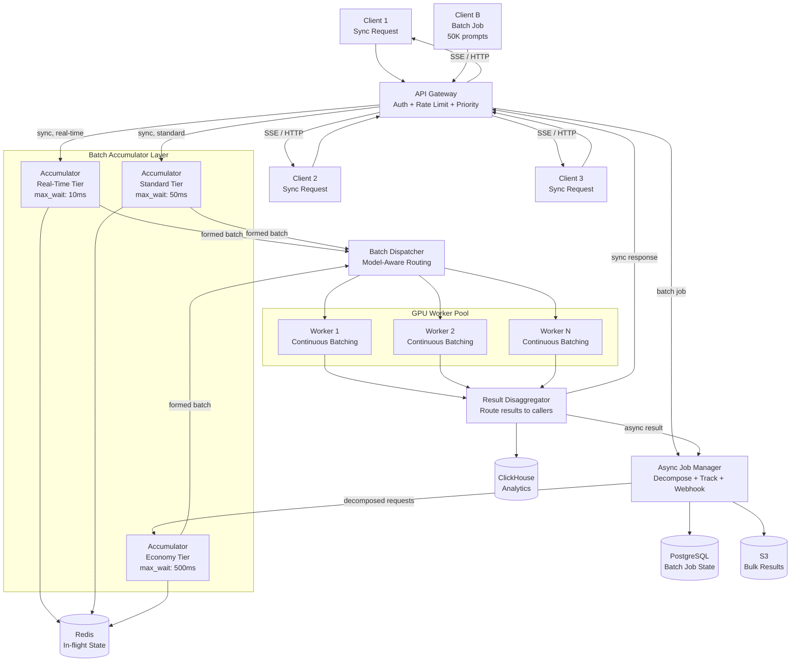
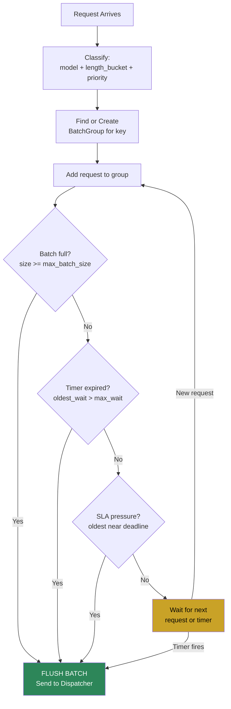
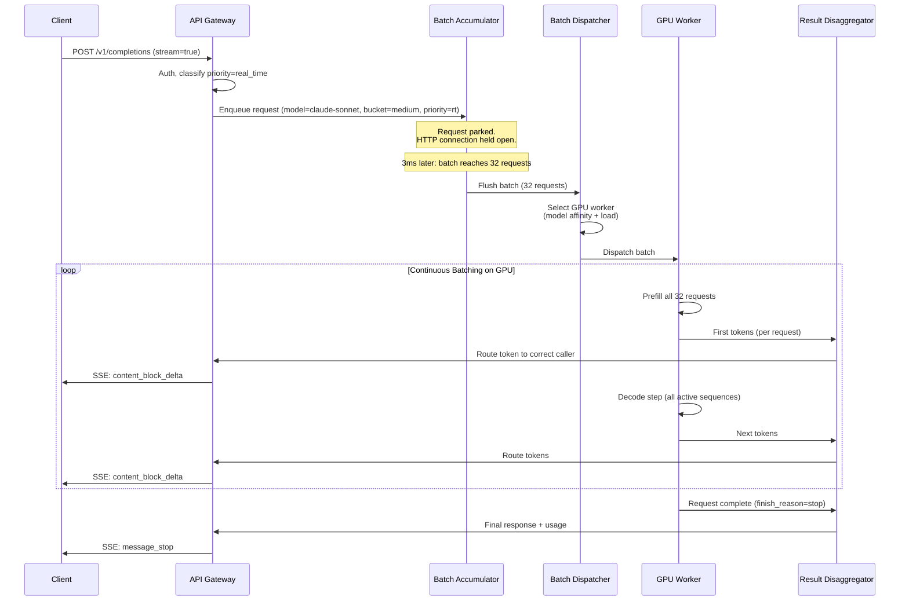
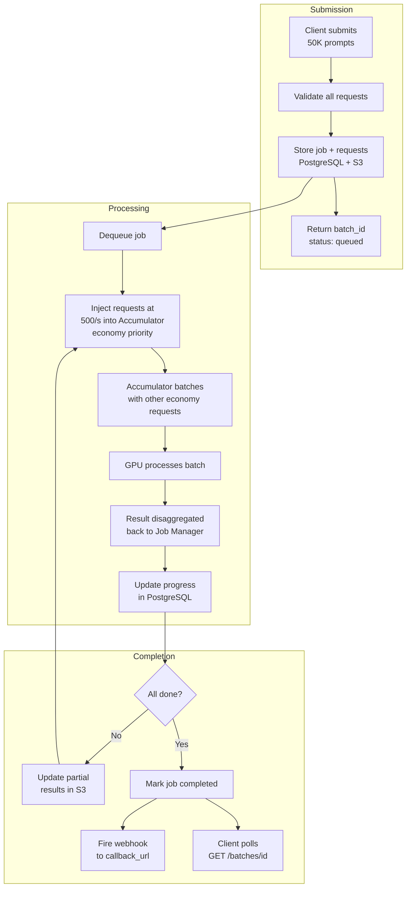

# LLM Batch Processing Service -- Architecture Diagrams

## 1. High-Level Architecture

## 2. Batch Accumulator Decision Flow

## 3. Synchronous Request Lifecycle (Sequence)

## 4. Async Batch Job Lifecycle

