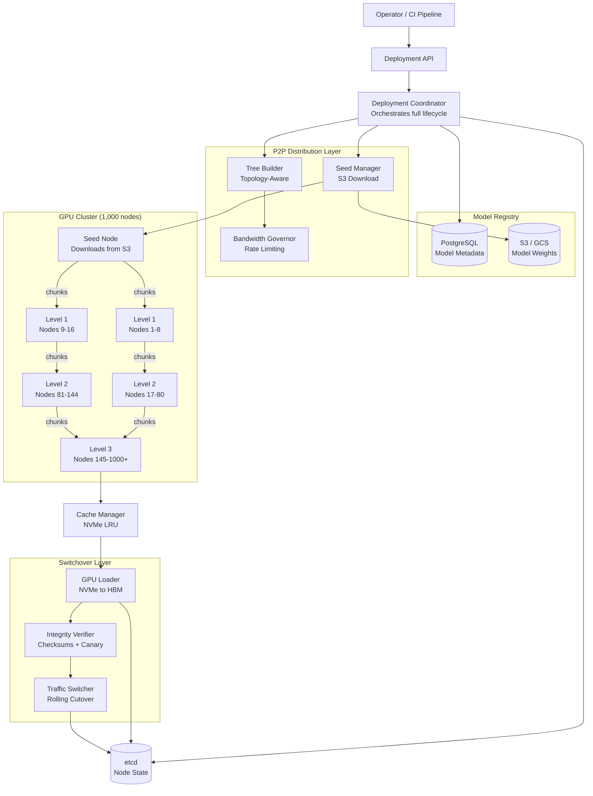
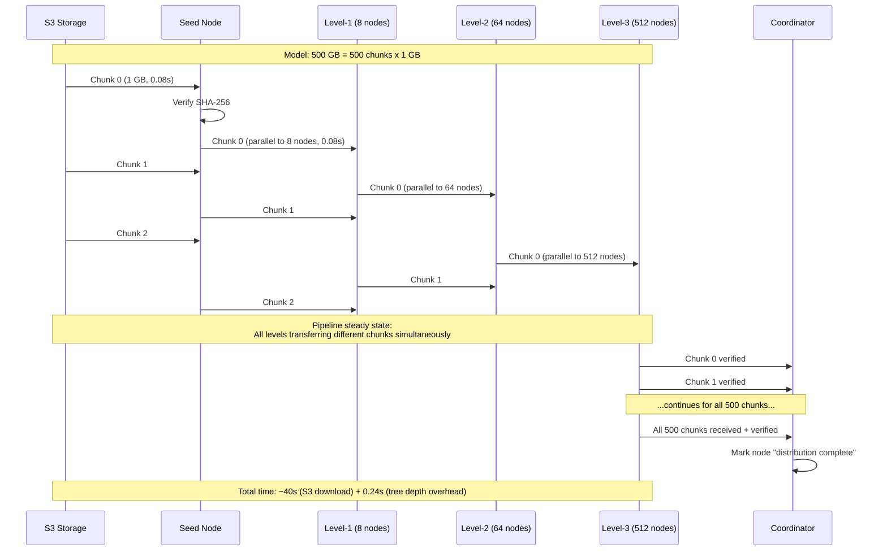
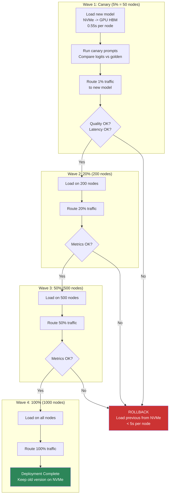
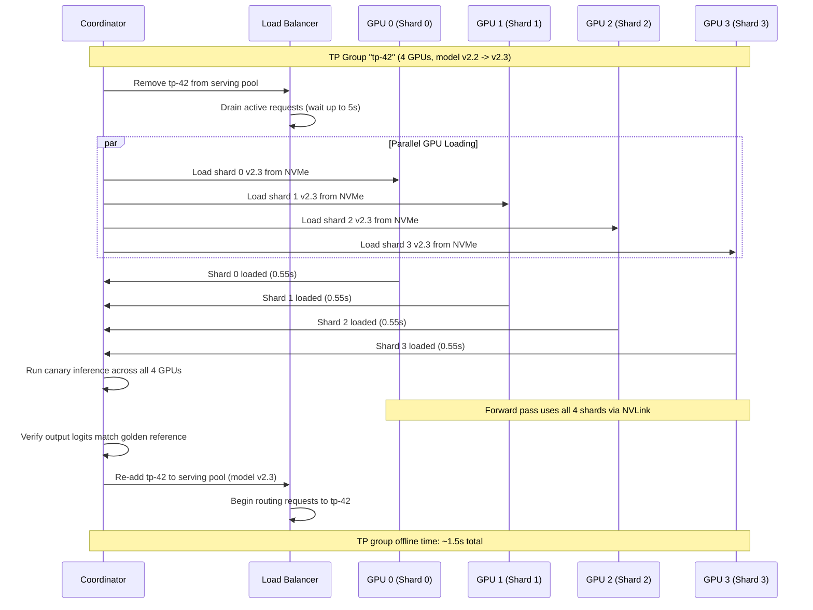

# Distributed Model Deployment -- Architecture Diagrams

## 1. High-Level Architecture

## 2. P2P Chunk Pipelining Timeline

## 3. Zero-Downtime Switchover Flow

## 4. TP-Group Atomic Switchover Detail

